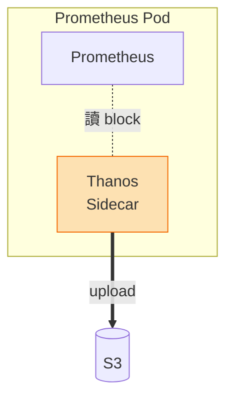
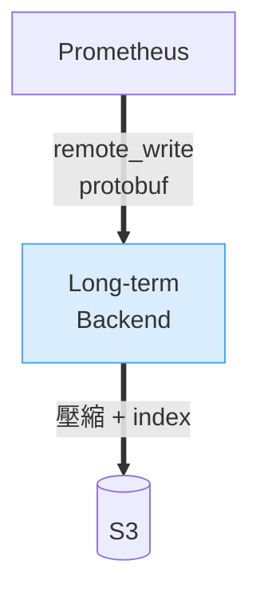
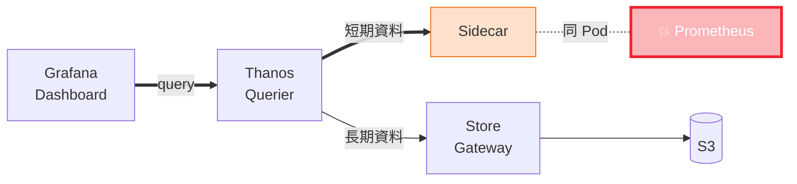
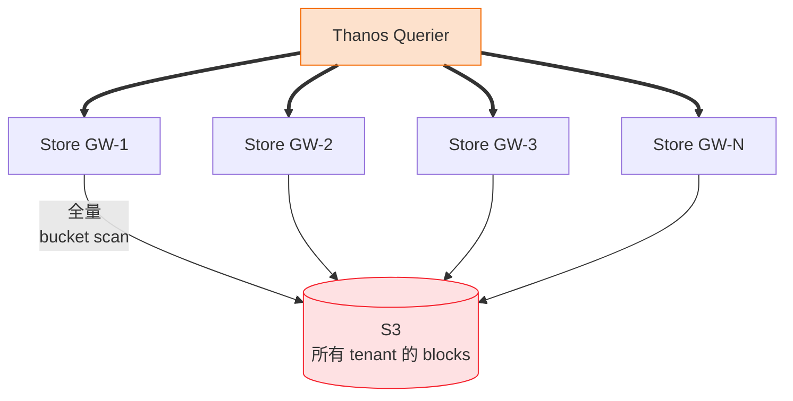
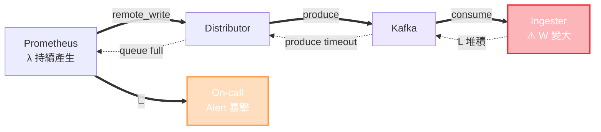

# 從 Thanos 到 Mimir 3.0

## 我們如何把可觀測性後端玩到極致

  Mike Hsu

  40 min
  Mimir 3.0
  AutoMQ

<!--
開場建議（自由發揮）：
- 自我介紹 + 今天 40 分鐘要帶大家走的路
- 這場演講會分享我們從 Thanos 遷移到 Mimir 的真實歷程
- 包含選型思考、踩坑、真實成本數字
- 最後會帶大家看一下長期指標後端的未來方向（Parquet Gateway）
-->

---
layout: quote
pre: "AI 原生時代下"
---

# 可觀測性後端 正在經歷一場 根本性的重寫

<!--
切入動機（用自己的口吻補充）：
- 以前 metrics 是給 SRE 早上喝咖啡時看 dashboard 用的
- 現在組織裡越來越多人建立自己的 agent — SRE agent、DB agent、service agent
- 一個人消化資訊的能力有限，AI agent 可以一秒內消化大量資料
- 我們原本的 metrics 基礎設施 (Thanos) 每天被這些 agent 嚴峻考驗
- 這就是為什麼我們要認真重新審視整個長期指標後端
-->

---
layout: default
---

# 我們面對的量級

<Stat value="17+" label="Prometheus Clusters" />
<Stat value="~40M" label="Active Series" accent="cyan" />
<Stat value="~1.2M" label="Samples / sec" accent="purple" />
<Stat value="2 年" label="Thanos 服役時間" accent="red" />

  Sportybet 生產環境 · 跨多個 Kubernetes 集群

<!--
補充（自由發揮）：
- 簡短介紹 Sportybet 的業務規模
- 當初選 Thanos 是 2023 年最成熟的開源方案
- 這個規模讓我們踩到了所有 Thanos 會踩的坑
- 數字可根據公開允許程度調整
-->

---
layout: section-blue
chapter: "01"
parent: Thanos → Mimir 3.0
---

# 長期指標後端 架構介紹

先從兩種主流整合模式切入

<!--
進入第一大段：架構介紹
不要花太多時間科普，我們團隊內部都熟悉 Prometheus 生態
這段的目的是讓聽眾跟著我的思路建立對比架構
-->

---
layout: default
---

# 為什麼需要長期指標後端？

<h3 class="!text-base !text-cyan-400">Prometheus 本身的限制</h3>

<v-clicks>

- 預設本地保留 **15 天**
- 單機儲存、單點失敗
- 無法跨集群統一查詢

</v-clicks>

<h3 class="!text-base !text-cyan-400">工程師的真實需求</h3>

<v-clicks>

- 「上個月的 baseline 是什麼？」
- 「黑五 vs 平日負載對比」
- 「SLO 的年度達成率」
- AI agents 的大量歷史回溯查詢

</v-clicks>

  需要一個高吞吐 · 低延遲 · 便宜的後端

<!--
- 這張快速過，聽眾都懂
- 重點是最後一個 bullet：AI agent 的歷史回溯 — 這是現在新出現的需求
- 強調這跟以往的「偶爾查看 dashboard」是不同量級的
-->

---
layout: default
---

# 兩種整合模式

<h3 class="!text-base !text-orange-400 mb-2 text-center">Sidecar Mode</h3>

  Sidecar 寄生於 Prom Pod 直接上傳 TSDB block

<h3 class="!text-base !text-cyan-400 mb-2 text-center">Remote-Write Mode</h3>

  Prom push 給後端 後端負責壓縮與 index

  我們原本用的是 <strong class="text-orange-400">Sidecar Mode</strong> · 這是個很天才的設計

<!--
補充：
- Sidecar 是 Thanos 的標誌性設計，跟 Cortex/Mimir 的 remote_write 哲學不同
- 兩者各有優缺點，先看 Sidecar 的妙處
-->

---
layout: default
---

# Sidecar Mode 的巧妙之處

```mermaid {theme: 'dark', scale: 0.82}
flowchart LR
    subgraph Prom["Prometheus 記憶體"]
      TSDB[[in-memory TSDB]]
    end
    TSDB ==>|每 2h 壓縮| B[TSDB Block]
    B --> LD[(Local Disk)]
    B -.->|Sidecar<br/>原封不動 upload| S3[(S3)]
    style B fill:#f4680033,stroke:#f46800,stroke-width:2px
    style Prom fill:#1e2540,stroke:#42a5f5
```

<Callout type="win" title="關鍵洞察">
<strong>S3 上的 block 和本地 disk 完全一樣</strong> 
Sidecar 不做任何運算
</Callout>

<Callout type="info" title="對比 Remote-write">
Backend 要解 protobuf → 
重新壓縮 → 建 index 
相當於把運算做了兩次
</Callout>

  理論上 Sidecar 避免了後端重新壓縮運算的浪費

<!--
補充（重要）：
- 這張是為了鋪陳「Sidecar 不是笨設計，它有它的巧妙」
- 這樣接下來的痛點討論才誠實
- 讓聽眾知道我們不是盲目換掉 Sidecar，是因為遇到了 Sidecar 架構的結構性問題
-->

---
layout: default
---

# 但是——痛點 ① 短期查詢放大 Prometheus 的垂直瓶頸

  短期查詢的壓力<strong class="text-red-400">全部打回 Prometheus</strong>

  
Our Production

  
512

  
GiB / Pod

  
Prom + Sidecar 垂直到極限

<!--
這是整場第一個 money shot。
補充（自由發揮）：
- 512 GiB 聽起來很誇張，但那是我們真實的 production 數字
- 我們的 Prometheus 已經在單一節點 vertical 到這個程度
- 繼續往下走只剩兩條路：買更大的機器 / 或換架構
- 這個數字是我們決定遷移的第一個導火線
-->

---
layout: default
---

# 痛點 ② 長期查詢 Store Gateway 掙扎

  每個 Store Gateway 都要掃<strong>整個</strong> bucket · Querier fan-out 到所有 SG

<h3 class="!text-base !text-cyan-400 mb-2">結構性問題</h3>

<ul class="icon-list">
<li v-click><mdi-magnify-scan class="text-rose-400" /> Bucket scan 是 <code>O(all_blocks)</code></li>
<li v-click><mdi-download-outline class="text-amber-400" /> Index header 先下載才能查</li>
<li v-click><mdi-scissors-cutting class="text-orange-400" /> Sharding <strong>靜態</strong>（硬切 relabel）</li>
<li v-click><mdi-tune-variant class="text-purple-400" /> Cache 參數多 · 難調教</li>
</ul>

  → Mimir 用 per-tenant <strong class="text-green-400">Bucket Index</strong> + 動態 sharding 解決這些

<!--
補充：
- 這段不要深講 11 維度的比較，聽眾會消化不下
- 重點讓聽眾感受：Mimir Store-Gateway 是為大規模多租戶設計的，Thanos 是從 Prometheus 長出來的
- 兩者的設計前提不同，不是誰對誰錯
-->

---
layout: default
---

# 我們考慮的三條路

  

    ①
    <strong class="text-lg">保留 Prometheus Server + 切 remote_write 到 Mimir</strong>
    選這條
  

  
省掉 Sidecar，Prom Server 繼續扮演 alert / HPA / KEDA 的可靠來源

  

    ②
    <strong class="text-lg opacity-70">拔掉 Prom Server，改用 Prometheus Agent</strong>
    太激進
  

  
所有 query 指向 Mimir，對可靠性要求極嚴苛 — HPA/KEDA 斷線 = 業務掛掉

  

    ③
    <strong class="text-lg opacity-70">繼續用 Thanos + 補強</strong>
    治標
  

  
短期緩解，但結構性問題沒解決，只是推延

  選 ① 的關鍵：Prom Server <strong class="text-orange-400">單純穩定</strong>，是 alert / autoscaling 的最後防線

<!--
補充（重要）：
- 這張展示我們的選型不是拍腦袋決定
- 特別強調 ②（Prom Agent）的風險：HPA/KEDA 依賴 metrics 作決策，如果 metrics backend 不穩，business 會受直接影響
- 所以保留 Prom Server 是一個「保險」決策 — 未來想切 Prom Agent，這條路還能走
-->

---
layout: section-blue
chapter: "02"
parent: Thanos → Mimir 3.0
---

# Mimir 3.0 架構

Grafana Labs 的新答案

<!--
進入 Mimir 3.0 介紹段
先給大畫面 (官方圖)，再拆解
-->

---
layout: default
---

# Mimir 3.0 的三大賣點

  

  Ingest Storage · 
  Mimir Query Engine · 
  全新設計的架構

<!--
補充：
- 這是 Grafana Labs 官方簡報的一張
- 三個關鍵字：Reliability / Performance / Cost
- 接下來我會拆這兩個支柱講
-->

---
layout: default
---

# Ingest Storage — Kafka 化的寫入路徑

  

<Callout type="info" title="Distributors">
無狀態，專注寫入接收與 sharding
</Callout>

<Callout type="info" title="Kafka">
作為寫入的 durable buffer
</Callout>

<Callout type="info" title="Ingester">
變成 Kafka consumer，**從 offset 重建狀態**
</Callout>

<!--
補充：
- 這是 Mimir 3.0 架構的核心改變
- 傳統 Mimir 2.x 是 Distributor 直接 push 到 Ingester (gRPC)，Ingester 有狀態 (in-memory TSDB)
- 現在 Distributor 只需要 produce 到 Kafka，Ingester 變成 consumer
- Ingester 重啟只要從 Kafka offset 追回，不怕 gap
- 這個設計的核心：Ingester + Partition 綁定，每個 partition 都是一份完整的資料
-->

---
layout: default
---

# Write/Read Path 完全解耦

  

<Callout type="win" title="設計哲學">
<strong>讀取端掛了，寫入端依然健康</strong> — 熱查詢爆炸不再會拖垮寫入
</Callout>

<!--
補充：
- 這張圖視覺效果很強：Write ✅ HEALTHY / Read ✗ UNHEALTHY
- 傳統 Mimir 2.x：Ingester 同時服務寫入和讀取，heavy query 會打爆 Ingester
- 現在：Write path 只到 Kafka 就結束了
- 這對運維的意義：query 端的問題不會變成寫入事件
-->

---
layout: default
---

# Mimir Query Engine (MQE) 效益

  

<Stat value="92%" label="Less memory vs Prometheus" accent="green" />
<Stat value="38%" label="Faster execution" accent="cyan" />

<!--
補充：
- MQE 在 Mimir 3.0 是 default
- 相比舊的 Prometheus engine，streaming execution + optimization framework
- 這張 benchmark 是官方 1h range query 1000 series 的 sum() 測試
- 實際 Grafana Cloud 跑下來 querier peak memory 降 3x、peak CPU 降 80%
- 這個是「我們遷移後立刻拿到的」好處，不需要做什麼
-->

---
layout: section-blue
chapter: "03"
parent: Thanos → Mimir 3.0
---

# Kafka 選型 — AutoMQ

多一個元件，是不是要把自己搞死？

<!--
進入 Kafka / AutoMQ 章節 — 整場演講的重頭戲
開場用這句話引出下一張
-->

---
layout: default
---

# 等等，加 Kafka 不就更複雜嗎？

  很多人的第一反應：

  

    「原本一個長期指標系統就夠複雜了， 現在還要加 Kafka？」
  

  
答案要從這個定理說起

  
L = λ · W

  
Little's Law · 李式定理

<!--
補充：
- 我當初跟主管討論時也被問過這個問題
- 加一個元件 = 多一份複雜度，這是直覺
- 但實際上複雜度不會憑空消失，你只是選擇把它放在哪裡
- 李式定理告訴我們的是：系統吞吐的本質
-->

---
layout: default
---

# 雖然可靠——但真實經驗是...

  虛線 = 回堵方向 · 任何一環節的 W 變大都會一路反噬到最上游

<Callout type="warn" title="真實踩坑">
Kafka consumer 慢（根因其實在下游 Ingester） 
→ Kafka 堆積 → Distributor produce timeout 
→ Prom queue full → 全環境噴 alert
</Callout>

<Callout type="info" title="學到的事">
加 Kafka 不是免費的午餐 
<strong>你接受了這個複雜度</strong>，換來上層的解耦 
所以選型要算清楚這筆帳
</Callout>

<!--
重要（誠實調性）：
- 這段是我想表達的核心態度：不盲目推薦
- 分享真實踩坑：有一次 Kafka consumer 變慢，根因追到 Ingester
- 但當下看到的是「Prom 噴 queue full alert」
- 這種跨元件 debug 是 Kafka 架構的固有複雜度
- 我們接受了這個，因為換來的好處夠大（下面會講）
-->

---
layout: default
---

# Kafka 的下一個十年

<h3 class="!text-base !text-purple-400 mb-3">KIP-1150 Diskless Topics</h3>

<v-clicks>

- 2025/4 提出 · **2026/3/2 正式通過**
- 9 binding + 5 non-binding votes
- Confluent / IBM / Aiven / Red Hat 共同背書
- Broker 變成 stateless，state 下放 object storage
- aiven/inkless 已有 fork 實作

</v-clicks>

<Callout type="info">
<strong>社群共識</strong>：Kafka 的未來是 cloud-native
</Callout>

  

<!--
補充：
- 這張配上小紅書截圖，非常有「真實截圖感」
- 這是 Kafka 社群的重要時刻：連 Apache 官方都承認要往 stateless 走
- AutoMQ 不是一個冒險的選擇，是走在社群共識的前面
- 小紅書那張是 Aiven 的 Josep 和 Greg（Diskless 主力推手）的消息
-->

---
layout: default
---

# 傳統 Kafka 的三大痛點

  
① 維運

  <h3 class="!text-base mb-3">Broker 是有狀態的</h3>
  

    Partition data 存在本地磁碟 
    重啟 / 擴縮 / 修復都要搬資料
  

  
② 水平擴展

  <h3 class="!text-base mb-3">Rebalance storm</h3>
  

    加 broker / 縮 broker 
    都會觸發大量 partition 遷移
  

  
③ 跨區流量

  <h3 class="!text-base mb-3">大多數成本來源</h3>
  

    Replication + producer/consumer 
    <strong>跨 AZ 流量費是帳單主角</strong>
  

  重度使用過 Kafka 的朋友會秒懂 — 這三個是 Kafka 帳單上的主要項目

<!--
補充（誠實聊成本）：
- 第 ③ 項跨區流量通常被低估
- 我們 AWS 帳單上，Kafka 的 cross-AZ data transfer 有時比 EC2 還貴
- 原因：producer-broker / broker-broker replication / broker-consumer 都可能跨 AZ
- 這就是 AutoMQ 最能打的地方
-->

---
layout: default
---

# AutoMQ — Shared Storage 架構

  

  核心：<strong class="text-green-400">Storage 與 Compute 徹底分離</strong> · Broker 變 stateless · P99 < 10ms

<!--
補充：
- 這張是 AutoMQ 官方對比圖
- 左邊是傳統 Kafka (Shared Nothing)：每個 broker 有自己的 disk + replication
- 右邊是 AutoMQ (Shared Storage)：所有 broker 共享 object storage
- 核心優勢：
  1. Storage 和 Compute 分離
  2. Zero partition data replication (因為 S3 本身就是多副本)
  3. Low latency on S3 (P99 < 10ms)
- Kafka API 100% 相容 — 這是關鍵，不用改 client
-->

---
layout: default
---

# Zero-Zone Router — 跨區流量歸零

  

<Callout type="win" title="神來一筆的設計">
Producer 寫入 <strong>本地 AZ 的 broker</strong> → 透過 S3 路由到 leader partition → 
Consumer 從 <strong>本地 AZ 的 readonly replica</strong> 讀取 → 跨 AZ 流量歸零
</Callout>

<!--
補充（Zero-Zone Router 分步講解，這頁可以講 2-3 分鐘）：
1. Producer 在 AZ2 寫入，它只需要寫到 AZ2 的 broker（本地）
2. AZ2 的 Rack-aware Router 把資料透過 S3 「路由」給 AZ1（leader partition 所在地）
3. AZ1 從 S3 讀取資料完成寫入
4. 所有其他 AZ 透過 S3 複製拿到 readonly 副本
5. Consumer 在 AZ2 讀取，只需從 AZ2 的 readonly replica 讀（本地）
結果：Producer ↔ Broker / Consumer ↔ Broker 全部 in-AZ
唯一的跨 AZ 流量：broker ↔ S3，而這在 AWS 同 region 的 S3 是免費的
-->

---
layout: default
---

# 延遲的哲學取捨

Traditional Kafka (EBS)

~50ms

P99 end-to-end

AutoMQ S3Stream

~500ms

P99 end-to-end

10 倍延遲差異——我們在乎嗎？

長期指標後端不在乎

Alert / HPA / KEDA 仍然走 Prom Server Mimir 是秒級的 long-term storage

<!--
補充（關鍵洞察）：
- 這張呼應前面「為什麼保留 Prom Server」的選型決策
- 關鍵決策鏈條：
  - 保留 Prom Server → 短期查詢走 Prom（毫秒級）
  - 長期查詢走 Mimir → 可以接受 500ms
  - Alert / HPA / KEDA 繼續用 Prom → 業務不受 AutoMQ 延遲影響
- 所以 50ms → 500ms 的代價，換來 10+ 倍成本降低和運維解放
- 這是典型的 engineering tradeoff：知道自己在意什麼，就能做出聰明選擇
-->

---
layout: section-blue
chapter: "04"
parent: Thanos → Mimir 3.0
---

# 成本效能實戰成果

數字會說話

<!--
進入成果展示段
這段要放輕鬆一點，讓聽眾有「哇」的反應
-->

---
layout: default
---

# 實測效能對比

  

<Stat value="3.4×" label="平均查詢加速" accent="green" />
<Stat value="45/48" label="測試項目勝出" accent="cyan" />
<Stat value="16.7×" label="Cross-metric Join 30d" accent="orange" />
<Stat value="8.4×" label="High-cardinality 1h" accent="purple" />

<!--
補充：
- 這是我們跑的 8 種 query × 6 個時間範圍 = 48 組測試
- 用 cache busting 確保測真實效能不是 cache hit rate
- 最有趣的發現：長期查詢 Mimir 的優勢反而更大（30d = 6.3x）
- 完全顛覆「Thanos 擅長長期查詢」的迷思
-->

---
layout: default
---

# 3 週 AWS 成本實測

  

    Thanos
    
$32,525

  

  

  

    Mimir + AutoMQ
    
$16,602

  

  

  Dec 8-28, 2025 · 同一生產環境 · 真實 AWS billing

<!--
補充：
- 這是 AWS Cost Explorer 的真實截圖，不是我編造的數字
- Thanos 這邊 EC2 instance 就吃了 $18,058 — 因為 Thanos 的 Store Gateway 要大量 compute
- Mimir 這邊 EC2 instance 只要 $6,132 — MQE + Ingest Storage 的效率
- Data transfer cost Mimir 反而高一點 $9,054 — 因為有 Kafka traffic
- 但整體還是便宜 49%
-->

---
layout: fact
---

# 49% 更便宜

  年度預估節省 $254,771

  3.4× 更快 · 
  49% 更便宜 · 
  6.6× 性價比

<!--
這張是「成果段的 money shot」
講的時候要慢，讓數字在空氣中停留
可以補一句：「這個 ROI 讓我把遷移提案推上去時非常好講」
-->

---
layout: section-blue
chapter: "05"
parent: Thanos → Mimir 3.0
---

# 下一站 — 可觀測性 2.0?

PromCon 2026 帶回來的新東西

<!--
進入最後一段
這段是「帶禮物回家」的段落
讓聽眾覺得「我學到新東西，還想回去研究」
-->

---
layout: default
---

# 可觀測性 2.0 的訊號

<Callout type="info" title="口號">
把 <strong>logs / traces / metrics</strong> 全部倒進 <strong>data warehouse / data lake</strong>， 
用統一的查詢引擎交叉分析
</Callout>

<h3 class="!text-base !text-cyan-400 mb-2">支持者（資料庫廠商）</h3>

<v-clicks>

- ClickHouse — 大力鼓吹
- AWS Athena — 把 metrics 導進來吧
- 核心論點：**columnar 格式**對高基數資料超友善

</v-clicks>

<h3 class="!text-base !text-red-400 mb-2">為何不溫不火</h3>

<v-clicks>

- PromQL 生態太大太穩
- SQL vs PromQL 轉換成本高
- Dashboards / alerts 生態綁死 Prom

</v-clicks>

  但 Prometheus 生態沒有放棄這個方向

<!--
補充：
- 可觀測性 2.0 是一個 buzzword 但背後有真實的技術洞察
- 問題是轉換成本太高，PromQL 生態太大
- 重點：Prom 生態內部也在吸收這些 columnar 的好處
-->

---
layout: default
---

# PromCon 2026 — Parquet Gateway

  
Grafana Labs

  
Jesús Vázquez

  
Mimir 核心

  
AWS

  
Alan Protasio

  
Cortex / Amazon Managed Prometheus

  
Cloudflare

  
Michael Hoffmann

  
Thanos maintainer

<Callout type="info" title="三大社群聯合發聲">
<strong>Cortex · Thanos · Mimir</strong> 的核心維護者同台 
宣告下一代 Prometheus 長期儲存後端的共同方向：<strong class="text-orange-400">Parquet Gateway</strong>
</Callout>

  用 <strong class="text-orange-400">Parquet</strong>（columnar format）取代 Prometheus TSDB block 
  彌補 TSDB 在 object storage 上的結構性缺陷

<!--
補充：
- 這個三家同台的畫面本身就是 message
- 過去三個社群是互相競爭的，現在共同發聲
- 背後的源起是 Shopify 的 Filip Petkovski 在 Thanos 提的 Parquet PoC
- Cloudflare 的 parquet-tsdb-poc 是最早的實作
- 最終匯流到 prometheus-community/parquet-common 的共享 library
-->

---
layout: default
---

# 為什麼 TSDB 不適合 Object Storage?

<h3 class="!text-base !text-cyan-400 mb-3">I/O 經濟學的根本差異</h3>

<v-clicks>

- **SSD random read** 固定成本：`~100μs`
- **S3 random read** 固定成本：`~10-50ms`
- **差異：100-500×**

</v-clicks>

<h3 class="!text-base !text-orange-400 mb-3">一個查詢的代價</h3>

<v-clicks>

  
TSDB on S3

  
100+ random GETs

  
Parquet on S3

  
3-4 sequential reads

</v-clicks>

  <strong class="text-orange-400">Request 數量才是成本</strong>，不是 bytes 數量

<!--
補充（first principles）：
- 這是整個 Parquet 故事最核心的 insight
- TSDB 是為本地 SSD 設計的，random read 便宜
- S3 上每個 request 都是 HTTP round-trip
- 所以設計哲學要改：「多讀一點 bytes 沒關係，但少發幾次 request」
- 這就是 columnar + sequential read 的威力
- 實測：GetRange calls 減少 90%，查詢加速 80-90%
-->

---
layout: end
---

<h1 class="!text-6xl !font-black">謝謝聆聽</h1>

  Thanos → Mimir 3.0 → AutoMQ → Parquet ?

  
選型

  
理解瓶頸在哪裡 比追新技術重要

  
架構

  
Stateless 是 運維自由的基礎

  
心態

  
Time-sensitive selection 永遠在演進

  技術選型永遠是 <strong class="text-orange-400">time-sensitive</strong> 的

  我們今天的最優解，可能是明天的 legacy。 
  保持好奇，保持懷疑，保持實驗。

  Mike Hsu · <code>mike.hsu@opennet.tw</code>

<!--
結語：
- 三個 takeaway 是整場演講的精華
- "time-sensitive selection" 這個 takeaway 很重要
- 我們 2024-2025 年選 Mimir 是對的，但 2027 年的最優解可能是 Parquet-based 的什麼
- 保持學習、保持懷疑、保持實驗
- QA 時間
-->
