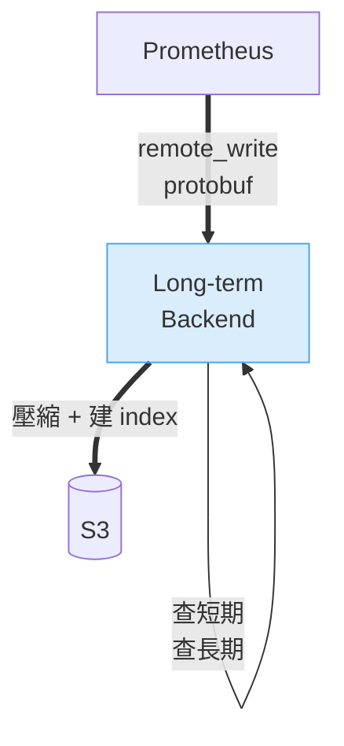
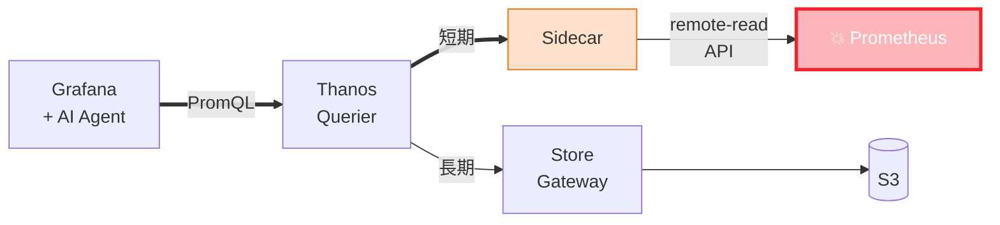
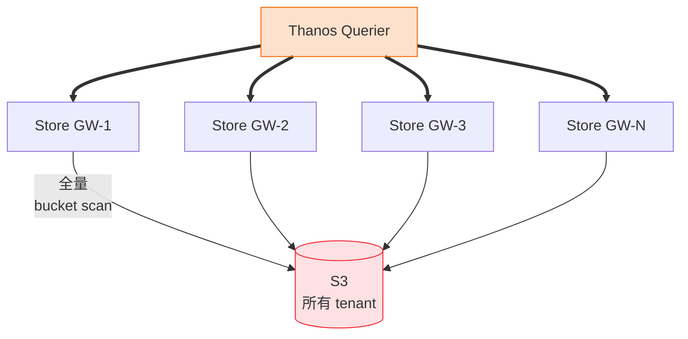
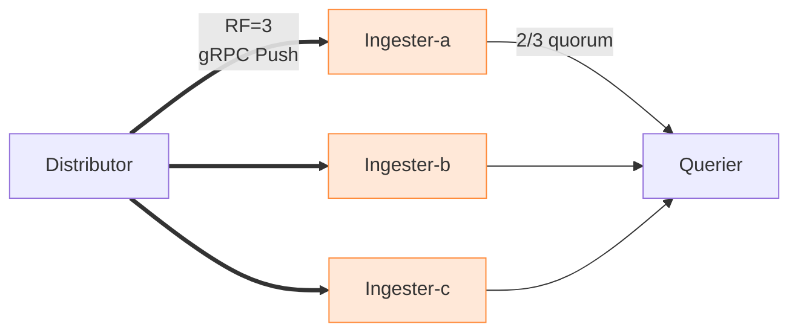
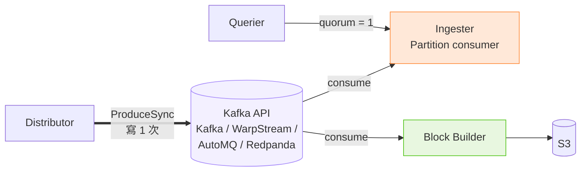
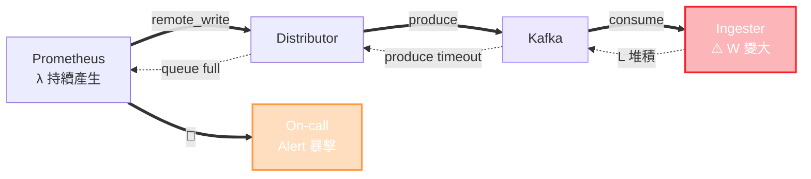
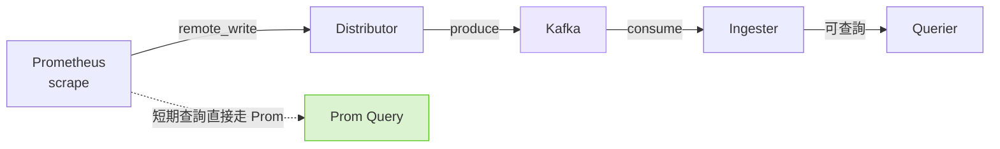
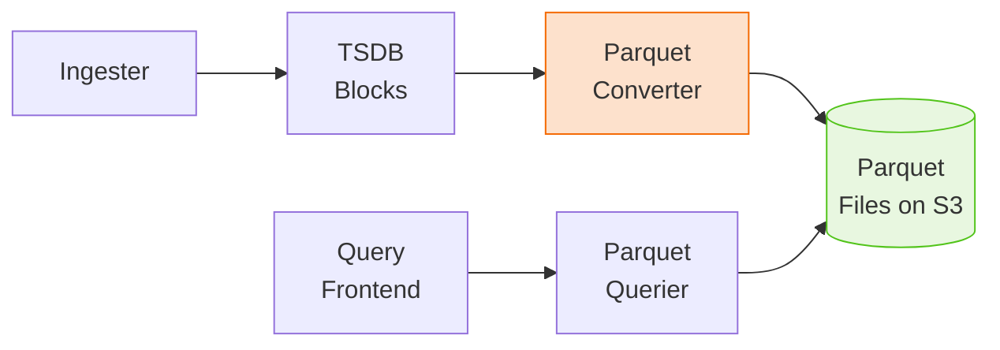

# 從 Thanos 到 Mimir 3.0

  AI 時代下 · 我們如何重構可觀測性的地基

  
Mike Hsu · PromConf Taiwan 2026

  
AI Agents · Mimir 3.0 · AutoMQ · Parquet Gateway

  40 min
  Mimir 3.0
  AutoMQ

<!--
開場提示：
- 自我介紹 + 今天要帶大家走過的這條路
- Hook 句：「最神奇的 AI 世界，底下跑的還是這些最不性感的基礎設施」
- 這是一份工程日誌，不是產品宣傳：會有踩坑、會有真實成本數字、會有沒解決的難題
-->

---
layout: statement
---

# 我們的 Metrics 後端 主要使用者 已經不再是人類

  觀測者，正從「人」變成「agent」

<!--
切入動機（hook 要講得慢一點）：
- 以前 metrics 是給 SRE 早上喝咖啡時看 dashboard 用的
- 現在組織裡越來越多人建立自己的 agent — SRE agent、DB agent、service agent
- 一個人消化資訊的能力有限；AI agent 一秒吞下一整面 dashboard，還會追著問下一層
- 查詢模式從「偶爾」變成「連續」、從「手動」變成「程式化」
- 我們原本的 metrics 基礎設施（Thanos）每天被這些 agent 嚴峻考驗
- 這就是為什麼我們要重新審視整個長期指標後端
-->

---
layout: default
---

# 這不是想像 — 我們公司的 SRE Agent

  

    
Reserved for Live Demo

    
▶ SRE Agent Videos

  

  
⏱ 20–30 sec budget

<Callout type="info" title="現在">
數個 agent 正在跑 使用人數尚未飽和
</Callout>

<Callout type="info" title="即將到來">
DB agent · Service agent Cost agent · Security agent
</Callout>

<Callout type="win" title="這只是開始">
提前預知趨勢 才有時間把地基打好
</Callout>

<!--
這頁是「影片位」，投影片負責 framing：
- 這幾部影片是我們 SRE team 正在跑的 agent
- 它們 24/7 在打我們的 metrics backend — 比任何 dashboard 都兇
- 未來會有更多 agent：DB agent、service agent、cost agent…
- 重點：這還只是 early adopter 階段。一旦全公司飽和，metrics backend 的負載是現在的幾倍
- 所以我們選型時，看的不是今天的工作負載，是兩年後的
-->

---
layout: default
---

# 我們面對的量級

<Stat value="40" label="EKS Clusters" />
<Stat value="120M" label="Peak Active Series" accent="cyan" />
<Stat value="8M" label="Samples / sec" accent="purple" />
<Stat value="365 天" label="保留週期" accent="green" />

<h3 class="!text-base !text-orange-400 mb-2">為什麼盯著 Active Series？</h3>

Ingester 記憶體 <strong class="text-orange-400">≈ 8 KB × active series</strong>（Grafana 官方經驗值）

・TSDB head chunk（近 1-2h raw samples）

・In-memory postings index（label → series ID 倒排）

・Label set 本身（高基數會膨脹）

120M × 8 KB ≈ <strong class="text-purple-400 text-lg">960 GB RAM</strong> 跑在 ingester 層

<Callout type="info" title="2023 我們選 Thanos">
當時最成熟的開源選項 
唯一有 <strong>Sidecar Mode</strong> 可以無侵入接上現有 Prometheus
</Callout>

服役 3 年，踩遍所有坑

<!--
這頁建立 credibility：
- 40 個 EKS cluster、尖峰 1.2 億 active series、每秒 8M samples、365 天保留
- 為什麼盯 active series？因為它**直接決定 ingester 記憶體**，而記憶體是長期指標後端最貴的資源
- 每條 series 約 8 KB（TSDB head chunk + postings index + label set）
- 1.2 億 × 8 KB = 960 GB — 光 ingester 就要這麼多 RAM
- 2023 選 Thanos 是當時正確的決定（sidecar mode 可以無侵入掛上現有 Prom）
- 但這個量級讓我們踩到所有結構性坑 — 正是今天要分享的故事
-->

---
layout: section
---

# 長期指標後端 架構介紹

兩種整合模式 · 兩種設計哲學

<!--
進入第一大段：架構介紹
團隊內部都熟悉 Prometheus 生態，這段快走
目的：讓聽眾跟著我的思路建立對比框架
-->

---
layout: default
---

# 為什麼需要長期指標後端？

<h3 class="!text-base !text-cyan-400">Prometheus 的先天限制</h3>

<v-clicks>

- 預設本地保留 **14 天**
- 單機儲存、單點失敗
- 無法跨集群統一查詢
- Ingester RAM 線性 ∝ active series — **垂直擴展的天花板**

</v-clicks>

<h3 class="!text-base !text-cyan-400">現實中的需求</h3>

<v-clicks>

- 「上個月的 baseline 是什麼？」
- 「黑五 vs 平日負載對比」
- 「SLO 的年度達成率」
- AI agents 的**連續性**歷史回溯查詢

</v-clicks>

<Callout type="win" title="關鍵需求">
需要一個 <strong class="text-orange-400">高吞吐 · 低查詢延遲 · 便宜</strong> 且能擺脫單機天花板的後端
</Callout>

<!--
- 這張快速過，聽眾都懂
- 強調：AI agent 的歷史回溯是**連續性 workload**，不是偶爾看 dashboard
- 一個 agent 在 30 分鐘分析窗口裡，可能發出幾千個 PromQL —— 這是新出現的需求模式
-->

---
layout: default
---

# 兩種整合模式

```mermaid {theme: 'dark', scale: 0.7}
flowchart TB
    subgraph Pod["Prometheus Pod"]
      direction LR
      P1[Prometheus]
      SC[Thanos<br/>Sidecar]
    end
    P1 -.-|讀 2h block| SC
    SC ==>|upload| S3[(S3)]
    SG[Store<br/>Gateway] -->|查歷史| S3
    SC -.->|remote-read<br/>查短期| P1
    style SC fill:#f4680033,stroke:#f46800
    style Pod fill:#1e2540,stroke:#42a5f5
```

<h3 class="!text-base !text-orange-400 mb-2 text-center">Sidecar Mode</h3>

  Sidecar 寄生 Prom Pod · 原封不動上傳 block 
  短期查詢走 remote-read 回 Prom

<h3 class="!text-base !text-cyan-400 mb-2 text-center">Remote-Write Mode</h3>

  Prom 推資料給後端 
  後端全權負責寫入與查詢

  我們一開始選的是 <strong class="text-orange-400">Sidecar Mode</strong> —— 這是個很巧妙的設計

<!--
- Sidecar 是 Thanos 的標誌性設計，跟 Cortex/Mimir 的 remote_write 哲學不同
- 延伸閱讀：thanos.io/blog/2023-11-20-life-of-a-sample-part-1/
- 下一頁講 Sidecar 的巧妙之處，鋪陳為什麼我們最後還是離開它
-->

---
layout: default
---

# Sidecar Mode 的巧妙之處

```mermaid {theme: 'dark', scale: 0.82}
flowchart LR
    subgraph Prom["Prometheus 記憶體"]
      TSDB[[in-memory TSDB]]
    end
    TSDB ==>|每 2h 壓縮| B[TSDB Block]
    B --> LD[(Local Disk)]
    B -.->|Sidecar<br/>原封不動 upload| S3[(S3)]
    style B fill:#f4680033,stroke:#f46800,stroke-width:2px
    style Prom fill:#1e2540,stroke:#42a5f5
```

<Callout type="win" title="關鍵洞察">
S3 上的 block 和本地 disk <strong>完全一樣</strong> 
Sidecar 不做任何壓縮、不重建 index
</Callout>

<Callout type="info" title="對比 Remote-write">
後端要解 protobuf → 
重新壓縮 → 重建 index 
<strong>同一份運算做了兩次</strong>
</Callout>

  理論上 Sidecar 避免了後端重新壓縮的浪費 — 所以我們選它是合理的

<!--
- 這張是為了鋪陳「Sidecar 不是笨設計，它有它的巧妙」
- 我們不是盲目換掉 Sidecar，是因為遇到了結構性問題
- 先說好話，後面批判才有重量
-->

---
layout: statement
---

# 但是 ⋯  我們撞牆了

接下來講痛點

<!--
過場頁：給聽眾一個心理緩衝
- 前面講完 Sidecar 的好
- 現在要誠實展示為什麼我們要離開
- 分兩個痛點：短期查詢 + 長期查詢
-->

---
layout: default
---

# 痛點 ① 短期查詢放大 Prometheus 的垂直瓶頸

  短期查詢經 Sidecar 回呼 remote-read API → 壓力全部打回 Prometheus

  
Single Prometheus Pod

  
512

  
GiB RAM

  

    <strong>Prometheus:</strong> 400+ GiB 
    <strong>Thanos Sidecar:</strong> 數十 GiB
  

  Sidecar 要為短期查詢扛 remote-read buffer → <strong class="text-red-400">記憶體壓力被放大</strong> · 必須配一台 512 GiB node

<!--
第一個 money shot。
- 這是真實 production 數字
- 細節：Thanos 在查短期（< 2h）時透過 sidecar 打 Prom 的 remote-read API
- 所以壓力不只回到 Prom，還要在 sidecar 端 buffer、decode、forward
- Sidecar 自己就要分掉幾十 GiB 記憶體
- 最後我們必須用 512 GiB node 才裝得下一個 Prom + Sidecar
- 這是**垂直擴展的瓶頸被放大**，不是 Prom 本身的問題，而是這個架構讓 Prom 不能水平切
- 參考：thanos-io/thanos/docs/components/sidecar.md
-->

---
layout: default
---

# 痛點 ② 長期查詢 Store Gateway 掙扎

  Querier fan-out 到所有 Store Gateway · 每個 SG 掃整個 bucket

<h3 class="!text-base !text-cyan-400 mb-2">結構性瓶頸</h3>

<v-clicks>

- Bucket scan 複雜度 `O(all_blocks)`
- Index header 先下載才能查
- Sharding **靜態**（relabel 硬切）
- Cache 參數多 · 調教難
- 重度查詢 → SG 直接 OOM

</v-clicks>

  → Store Gateway 一失守，<strong class="text-red-400">整個長期查詢鏈路就崩</strong>

<!--
- Thanos 的 sharding/caching 設計比較簡單直接
- 大流量下 Store Gateway 成為瓶頸：要處理所有查詢、還要 scan S3 上的所有 block
- 我們遇過：長期查詢高峰時 Store Gateway OOM，然後 Querier 噴 connection refused
- 重點讓聽眾感受：Mimir Store-Gateway 為大規模多租戶設計（bucket index、動態 sharding），Thanos 則是從 Prometheus 長出來的
- 不是誰對誰錯 — 設計前提不同
-->

---
layout: default
---

# 三條決策維度，我們一條一條想清楚

  

    維度 ①
    <strong class="text-base">Sidecar vs Remote-Write</strong>
    → 緩解<strong class="text-orange-400">短期</strong>垂直瓶頸
  

  
把壓縮 / index 的工作交給後端，解放 Prometheus + Sidecar Pod 記憶體

  

    維度 ②
    <strong class="text-base">Thanos vs Mimir</strong>
    → 解決<strong class="text-orange-400">長期</strong>查詢瓶頸
  

  
Mimir 的 bucket-index、動態 sharding、MQE — 為大規模多租戶而生

  

    維度 ③
    <strong class="text-base">Prometheus Server vs Prometheus Agent</strong>
    → 徹底消除<strong class="text-orange-400">採集端</strong>瓶頸
  

  
砍掉 Prom Server 本地 query/alert 責任 — <strong class="text-red-400">最激進，風險最高</strong>

  三個維度互相獨立 · 排列組合出來的方案我們會一起看

<!--
- 一次介紹三個決策維度 — 把思考空間先攤開
- ① 緩解短期瓶頸：可以先做
- ② 解決長期查詢：需要換後端
- ③ 砍 Prom Server：最激進，HPA / KEDA / Alert evaluation 都綁在 Prom 上
- 三個維度是「可以獨立組合」的，所以下一頁會畫排列組合
-->

---
layout: default
---

# 排列組合 · 一個一個刪去

  ※ 合法性約束：Mimir 只吃 remote-write（無 Sidecar 模式）· Prom Agent 無本地 TSDB（不能配 Sidecar）

  

    ①
    <strong>Thanos · Sidecar · Prom Server</strong>
    （現況）
    短期 + 長期都撞牆
  

  

    ②
    <strong>Thanos · Remote-Write (Receiver) · Prom Server</strong>
    短期解了，長期 Store Gateway 沒解
  

  

    ③
    <strong>Thanos · Remote-Write · Prom Agent</strong>
    長期沒解 · 又把 alert 風險疊加
  

  

    ④
    <strong class="text-green-400">Mimir · Remote-Write · Prom Server</strong>
    選這條
  

  
同時解短期 + 長期 · Prom Server 保留做 alert / HPA / KEDA 的可靠來源

  

    ⑤
    <strong>Mimir · Remote-Write · Prom Agent</strong>
    太激進 — HPA / KEDA / Alert 全綁 Mimir
  

  刪去法 → 剩下 <strong class="text-green-400">④</strong>：Mimir 換後端、Prom Server <strong>保留</strong> 做最後防線

<!--
- 排列空間的合法性約束要先點出來：
  - Mimir 沒有 Sidecar 模式（它只吃 remote-write）
  - Prom Agent 無本地 TSDB（沒 block 可給 Sidecar 上傳）
- 所以實際合法組合是 5 個（原本的 Sidecar+Mimir 根本不存在）
- ①②③ 都是 Thanos 系，結構性問題各自沒解完
- ⑤ 太激進：Prom Agent = alert / HPA / KEDA 全交給後端，後端抖動就業務抖動
- 保留 Prom Server 是**保險決策** — 未來想切 Agent，這條路還能走；反過來則不行
- 記住這個「保留 Prom Server」的選擇，**後面 AutoMQ 500ms 延遲那段會回來收**
-->

---
layout: section
---

# Mimir 3.0 架構

為什麼 Mimir 3.0 是這次遷移的臨門一腳

<!--
進入 Mimir 3.0 介紹段
先講為什麼是 Mimir 3.0，再拆解內部
-->

---
layout: default
---

# 為什麼偏偏挑這個時間點？

<h3 class="!text-base !text-orange-400 mb-2">Mimir 3.0 的時間點</h3>

<v-clicks>

- 2025 下半年推出
- 三大主題：<strong>Reliability · Performance · Cost</strong>
- 兩大新特性：
  - **Ingest Storage**（Kafka-API 寫讀解耦）
  - **Mimir Query Engine**（streaming + optimization）
- Grafana Cloud 自己 dogfood，報告 ~25% TCO 下降

</v-clicks>

<h3 class="!text-base !text-purple-400 mb-2">Grafana vs Thanos 的社群態勢</h3>

<v-clicks>

- Grafana Labs 對 **LGTM**（Loki / Mimir / Tempo）集中火力投資
- Mimir 每個 minor 都在重大升級
- Thanos 社群節奏**不快**（個人營運經驗）
- 文件<strong>不齊</strong> · 深度問題大多得翻 source code 才有答案
- 下一代儲存（Parquet Gateway）由**三家社群共同推** — 未來紅利 Thanos 也分得到

</v-clicks>

<Callout type="win" title="選型的風向判斷">
Thanos 是可靠的老兵，但 <strong class="text-orange-400">Mimir 正站在浪尖</strong> — 選方向比選當下更重要
</Callout>

<!--
- Mimir 3.0 剛好在我們評估的時間點推出
- 社群態勢是**我自己營運 3 年的第一手經驗**，不是引用外部報告：
  - Thanos 節奏不算快（相對 Mimir 的更新密度）
  - 文件不齊全，深度問題（sharding 行為、cache key、memory behavior）大多得翻 source code
- 下一代儲存 Parquet Gateway 三家社群共同推（後面 Slide 36 會展開）
- 我們選 Mimir 的理由不是「Thanos 要死了」，而是「Mimir 現在就有 Ingest Storage + MQE 可以兌現」
-->

---
layout: default
---

# Mimir 3.0 的三大支柱

  

    
  

Grafana Labs 官方 Mimir 3.0 架構

  
Reliability

  
寫讀徹底解耦

  
Kafka 中繼 · 讀端掛了寫依然健康 · quorum 從 2/3 降到 1

  
Performance

  
Mimir Query Engine

  
Streaming 取代全量載入 · Peak CPU ↓80% · Peak Mem ↓3×

  
Cost

  
Ingester 減半

  
Zones 從 3 降到 2 · 副本不靠 RF=3 · ~25% TCO ↓

  接下來拆兩個支柱講 — 先 Ingest Storage，再 MQE

<!--
- 上方先放 Grafana 官方 Mimir 3.0 架構圖，當視覺錨點 · 現場可指圖講：
  - 右半「Data to ingest → distributor → Kafka → ingesters」= 寫路徑（Ingest Storage 核心）
  - 左半「Queries → query-frontend → querier → ingesters + store-gateway」= 讀路徑
  - 虛線 Asynchronous transfers = ingester 非同步上傳 block 到 object storage
  - Compactor 在 object storage 背後壓縮
- 下方三卡片講三大支柱：Reliability（解耦）/ Performance（MQE）/ Cost（Ingester 減半）
- 下兩頁深入 Ingest Storage
-->

---
layout: default
---

# Ingest Storage — 從「3 副本寫入」到「1 次 Kafka produce」

<h3 class="!text-xs !text-red-400 !uppercase !tracking-widest mb-2">Mimir v2 · Classic</h3>

  
• 寫入走 gRPC Push，<strong>寫 3 次</strong>

  
• Querier 讀 2/3 才算成功

  
• Ingester 扛寫入 + 查詢 + 建 block + 上傳 S3

<h3 class="!text-xs !text-green-400 !uppercase !tracking-widest mb-2">Mimir 3.0 · Ingest Storage</h3>

  
• 寫 <strong>1 次</strong> 到 Kafka partition

  
• Querier 讀 <strong>1 個</strong> 健康 consumer 就夠

  
• Block 建構拆獨立元件，Ingester 只做 consume

  
為什麼要 2/3 quorum？

  
<strong>Dynamo-style 不變式：</strong> <code class="text-orange-300">R + W &gt; N</code>

  
W=2 · R=2 · N=3 → <strong>4 &gt; 3 ✓</strong>　讀集合與最新寫必交集

  
為什麼 quorum = 1 就夠？

  
<strong>Kafka partition = linearized log</strong>

  
每個 consumer 都是同一 log 完整 replay · 無分歧狀態 · 不需 overlap

<Callout type="win" title="引述官方（Jonathan @ Grafana Labs）">
「我們依賴的<strong>不是 Kafka，是 Kafka API</strong> — 可以換 WarpStream、Redpanda、AutoMQ — 選你能營運的」
</Callout>

<!--
- 左右對比把最關鍵的變化講清楚：
  - 寫入從 3 副本變 1 次
  - Ingester 從「什麼都做」變成純 consumer
  - Block 建構拆出去 — 各元件獨立 scale
- 強調 Kafka API 不是 Kafka — 這個很重要，為後面 AutoMQ 鋪路
- 原話引自 Grafana 官方影片，增強可信度
-->

---
layout: default
---

# Write/Read Path 完全解耦 · Quorum = 1

  

<Callout type="win" title="可用性翻轉">
v2：過半 zone 健康才算活 
v3：<strong>每個 partition 有 1 個消費者</strong>就算活
</Callout>

<Callout type="info" title="可用性變成旋鈕">
想更高可用？<strong>把 partition 數加一倍</strong> 
—— 而不是加整組 zone
</Callout>

  熱查詢再兇 · 寫入路徑只到 Kafka 就結束 · <strong class="text-green-400">Write 永遠 HEALTHY</strong>

<!--
- 這張圖視覺效果很強：Write ✅ / Read ✗
- v2 的 quorum 是 2/3，只要 2 個 zone 各死 1 個 ingester 就掛
- v3 的 quorum 是 1 — 每個 partition 有 1 個 ingester 活著就活
- 想提高可用性？加 partition（便宜），不用加整個 zone（貴）
- 對 SRE 的意義：查詢爆炸不再變成寫入事件；alert 的源頭不會因此消失
-->

---
layout: default
---

# 副本數學 — 成本最大的砍刀

<table class="w-full text-sm">
<thead>
<tr class="text-xs uppercase opacity-60 border-b border-white/10">
<th class="text-left py-2">維度</th>
<th class="text-center py-2">Classic RF=3 + 3 zones</th>
<th class="text-center py-2">Ingest Storage + 3 zones</th>
<th class="text-center py-2">Ingest Storage + 2 zones</th>
</tr>
</thead>
<tbody class="opacity-90">
<tr class="border-b border-white/5"><td class="py-2">副本決定方式</td><td class="text-center">RF=3（寫 3 次）</td><td class="text-center">zone 數決定</td><td class="text-center">zone 數決定</td></tr>
<tr class="border-b border-white/5"><td class="py-2">實際副本數</td><td class="text-center text-red-400">3×</td><td class="text-center">3×</td><td class="text-center text-green-400"><strong>2×</strong></td></tr>
<tr class="border-b border-white/5"><td class="py-2">Write 容錯</td><td class="text-center">1 zone (2/3 quorum)</td><td class="text-center">Kafka 負責</td><td class="text-center">Kafka 負責</td></tr>
<tr class="border-b border-white/5"><td class="py-2">Read quorum</td><td class="text-center">2/3</td><td class="text-center text-green-400">1/3</td><td class="text-center text-green-400">1/2</td></tr>
<tr class="border-b border-white/5"><td class="py-2">Read 容錯</td><td class="text-center">1 zone</td><td class="text-center text-green-400"><strong>2 zones</strong></td><td class="text-center">1 zone</td></tr>
<tr class="border-b border-white/5"><td class="py-2">Ingester 成本</td><td class="text-center text-red-400">3×</td><td class="text-center">3×</td><td class="text-center text-green-400"><strong>2×</strong></td></tr>
<tr><td class="py-2">額外成本</td><td class="text-center opacity-60">—</td><td class="text-center">Kafka</td><td class="text-center">Kafka</td></tr>
</tbody>
</table>

<Callout type="win" title="我們的選擇">
<strong>RF=2 + 2 zones</strong> — 把可用性從「RF 堆出來」換成「Kafka 保證 + partition 調整」
</Callout>

<!--
- Classic 生產必須 RF=3 + 3 zones（因為 RF=2 是 0 容錯 — quorum 要 2/2）
- v3 改用 PartitionInstanceRing：不再用 RF，由 zone 數決定副本
- 2 zones + Ingest Storage 拿到比 classic 3 zones 還強的 read 容錯
- 真正省到 33% ingester 資源
- 這是整個 Mimir 3.0 最大的成本殺手
-->

---
layout: default
---

# Mimir Query Engine · 讀端同步省下來

  

<Stat value="92%" label="Less memory vs Prometheus" accent="green" />
<Stat value="38%" label="Faster execution" accent="cyan" />
<Stat value="3×" label="Querier peak mem ↓" accent="purple" />
<Stat value="80%" label="Querier peak CPU ↓" accent="orange" />

  MQE 在 Mimir 3.0 是 <strong>default</strong> · 升級後<strong>自動拿到</strong>這些好處 · 覆蓋 100% 穩定 PromQL grammar

<!--
- MQE 的兩個核心：streaming execution + common sub-expression elimination
- Streaming：不再全量載入 series，operator-by-operator 往下推
- 實測 Grafana Cloud querier peak memory 降 3x、peak CPU 降 80%
- 最棒的是：升上去就有 — 不用改 query、不用加設定
- 接下來直接看我們遷移後的實測 dashboard
-->

---
layout: default
---

# 遷移後 · 寫讀兩端資源同時下降

  
Ingester · CPU

  

  
Ingester · Memory

  

  
Querier · CPU

  

  
Querier · Memory

  

<Callout type="win" title="寫（Ingester）+ 讀（Querier）同時兌現 · 同一生產集群 · 升級前後">
RF=3→2 + Ingest Storage → <strong>Ingester</strong> CPU/Mem 雙降 · MQE → <strong>Querier</strong> CPU/Mem 雙降
</Callout>

<!--
- 這四張是我們自己集群的真實 dashboard 截圖，不是 benchmark
- 橘色兩張：Ingester CPU / Memory — 寫路徑的紅利
  - RF 從 3 降到 2 · Ingest Storage 把副本責任交給 Kafka
  - 明顯看到升級當天一個斷崖式下降
- 青色兩張：Querier CPU / Memory — 讀路徑的紅利
  - MQE streaming execution 讓查詢不再全量載入 series
  - Peak 被壓平
- CPU / Memory 都明顯下降一個 level
- 不是 benchmark，是 production — 數字不漂亮，但真實
- 這只是 Mimir 側；下一段還要選 Kafka，才是真正的成本大戰
-->

---
layout: section
---

# Kafka 選型

多了一個元件 · 我們是不是在自己給自己找死？

<!--
進入 Kafka / AutoMQ 章節 — 整場重頭戲
這裡先不提 AutoMQ，讓聽眾陪我一起被「加 Kafka 就是複雜」這個直覺綁架一下
-->

---
layout: default
---

# 等等 ⋯ 加 Kafka 不就更複雜嗎？

  

    「原本一個長期指標系統就夠複雜了， 現在還要多一個 Kafka？」
  

  
答案要從這個定理說起

  
L = λ · W

  
Little's Law · 李氏定理

  
系統中的待處理量 = 到達速率 × 每件事的處理時間

<!--
- 我跟主管討論時第一個被問的問題就是這個
- 加元件 = 多複雜度，這是真的；但複雜度不會憑空消失，你只是選擇它放在哪裡
- 李氏定理：L 堆積 = 流入（控不住）× 處理時間（被下游拖慢）
- 加 Kafka 不是為了簡化，是為了**把耦合拆開** —— 下一頁看真實踩坑
-->

---
layout: default
---

# 現實中的 Kafka —— 分散式回堵噩夢

  虛線 = 回堵方向 · 任何一環 W 變大都會一路反噬到最上游

<Callout type="warn" title="Kafka 不永遠低延遲">
<strong>Rebalance</strong> · <strong>Leader 切換</strong> · <strong>Consumer lag</strong> 
任一件事都能把 5ms 變成 5 秒
</Callout>

<Callout type="info" title="我們學到的">
加 Kafka 不是免費的午餐 
你接受這個複雜度，換來上層解耦 
<strong>選型要算清楚這筆帳</strong>
</Callout>

<!--
- 這段是我想表達的核心態度：**不盲目推薦**
- 真實踩過坑：Kafka consumer 慢（根因在 ingester）→ Kafka 堆積 → Distributor produce timeout → Prom queue full → 全環境噴 alert
- 跨元件 debug 是 Kafka 架構的固有複雜度
- Kafka 不永遠低延遲 — rebalance、leader 切換、consumer lag、甚至 GC 都能讓 L 瞬間爆開
- 但這個複雜度是值得的，因為換來寫讀解耦 + 水平擴展
-->

---
layout: default
---

# Kafka 的下一個十年 · Diskless Wars

  
Aug 2023

  
WarpStream 發表 — Kafka-API on S3 首發商用化

  
May 2024

  
Confluent Freight 發表 — Streamative Cloud

  
Jul 2024

  
<strong>AutoMQ 1.0</strong> 發布 · S3 Direct 寫入支援

  
Sep 2024

  
Confluent 收購 WarpStream —— $220M

  
Apr 2025

  
<strong>Aiven 提出 Diskless Topics (KIP-1150)</strong>

  
Nov 2025

  
Redpanda 發表 Cloud Topics

  
Mar 2026

  
KIP-1150 正式通過 — Apache Kafka 擁抱 diskless

<Callout type="info">
<strong>社群共識已成形</strong> · stateless broker · object storage 為 source of truth
</Callout>

  

    
  

  KIP-1150 正式通過的社群公告 · Aiven / Confluent / Red Hat / IBM 等共同背書

<!--
- 左側時間軸：這兩年 Kafka 生態正在經歷一場 diskless 浪潮
  - 從 WarpStream（2023）開局，到 KIP-1150 今年 3/2 正式通過
- 右側截圖：小紅書上 Aiven 的 Josep / Greg 的通告 + 底下 Apache 郵件投票結果
  - 真實感很強，這不是 PR 稿，是社群裡真人真投票
  - 9 binding votes + 5 non-binding votes
- 結論：AutoMQ 不是冒險選擇，是走在共識已成方向上的最早一批
-->

---
layout: default
---

# 傳統 Kafka 的三大痛點

  
① 維運

  <h3 class="!text-base mb-3">Broker 有狀態</h3>
  

    Partition 綁本地 disk 
    重啟 / 擴縮 / 修復 
    <strong>每一次都要搬資料</strong>
  

  
② 水平擴展

  <h3 class="!text-base mb-3">Rebalance Storm</h3>
  

    加 broker → 觸發大量 partition 遷移 
    縮 broker → 同樣的故事 
    <strong>每次擴縮都是風險</strong>
  

  
③ 跨區流量

  <h3 class="!text-base mb-3">帳單主角</h3>
  

    Replication + producer + consumer 
    跨 AZ 流量 
    <strong>大叢集佔成本 60–70%</strong>
  

  重度用過 Kafka 的人會秒懂 — 這三個是每張 AWS 帳單上的主角

<!--
- 這三個點是 AutoMQ 要解決的東西
- 第 ③ 跨 AZ 流量通常被低估：producer 寫 broker、broker 間 replication、consumer 拉資料都可能跨 AZ
- AutoMQ 官方數字：大叢集跨 AZ 可以佔 60-70% 帳單
- 下一頁看 AutoMQ 怎麼重新想 Kafka 這件事
-->

---
layout: default
---

# AutoMQ · 重新設計的 Kafka

  

<Callout type="win" title="Storage / Compute 分離">
Broker 本地不存 partition data 
全部寫 S3 · <strong>broker stateless</strong>
</Callout>

<Callout type="win" title="Zero Partition Replication">
S3 本身多副本 
不用 broker 之間互相 copy 
<strong>replication 流量歸零</strong>
</Callout>

<Callout type="win" title="100% Kafka API">
Protocol 原生支援 
現有 Producer / Consumer 不用改 
<strong>切換零遷移成本</strong>
</Callout>

<!--
- AutoMQ 的基本構想：把 Kafka 的 local disk 換成 S3 + 小 WAL
- 傳統 Kafka：PageCache + Local Disk → Consumer（Zero Copy）
- AutoMQ：Producer → WAL + Message Cache → S3；Consumer 從 S3/Cache 拉（沒有 Zero Copy 但也夠快）
- 關鍵：100% Kafka API 相容 — 我們的 Prometheus distributor / Mimir ingester 完全不用改
-->

---
layout: default
---

# 跨 AZ 流量 · 傳統 Kafka 的黑洞

  

  
① Producer → Broker

  
寫入可能 hit 到其他 AZ 的 leader

  
② Broker ↔ Broker Replication

  
副本機制本質上<strong>幾乎必定跨 AZ</strong>

  
③ Consumer ← Broker

  
Consumer 不一定跟 leader 同 AZ

<Callout type="warn" title="AutoMQ 官方數據">
大叢集裡 <strong class="text-red-400">跨 AZ 流量佔 Kafka 總成本的 60–70%</strong> · 這筆錢不是花在你業務上，是花在 AWS 網路上
</Callout>

<!--
- 傳統 Kafka 的三種跨 AZ 流量：
  1. Producer → Broker：client 通常不知道 leader 在哪個 AZ
  2. Broker → Broker replication：這條幾乎免不了，除非 RF=1（不能用在 prod）
  3. Broker → Consumer：consumer 也不一定跟 leader 同 AZ
- 在 AWS 上這三條 traffic 通通算 inter-AZ data transfer（每 GB 都收錢）
- 大叢集可以佔到 60-70% 總成本 — 這比 EC2 本身還貴
- 下一頁看 AutoMQ 怎麼把這筆錢歸零
-->

---
layout: default
---

# AutoMQ 的解法 · Zero-Zone Router

  

  ①
  
Producer 寫入 <strong>本地 AZ</strong> 的 broker

  ②
  
Rack-aware Router 透過 <strong>S3</strong> 路由給 leader partition

  ③
  
其他 AZ 從 S3 同步拿 <strong>readonly 副本</strong>

  ④
  
Consumer 從 <strong>本地 AZ</strong> 的 readonly replica 讀取

  
唯一跨 AZ 流量

  
只有 <strong>broker ↔ S3</strong> · AWS 同 region S3 <strong class="text-green-400">免費</strong>

<Callout type="win" title="神來一筆的設計">
Producer / Consumer 全部 <strong>in-AZ</strong> · 跨 AZ 流量從 60–70% 成本歸 <strong class="text-green-400">零</strong>
</Callout>

<!--
Zero-Zone Router 分步講解（可以慢慢講 2 分鐘）：
1. Producer 在 AZ2 寫入 → 只寫 AZ2 的 broker（本地，不跨 AZ）
2. AZ2 的 Rack-aware Router 把資料透過 S3「路由」給 AZ1（leader partition 所在地）
3. AZ1 從 S3 讀取完成寫入 · 其他 AZ 也從 S3 拿 readonly 副本
4. Consumer 在 AZ2 讀取 → 只從 AZ2 的 readonly replica 讀（本地，不跨 AZ）

關鍵：
- Producer ↔ Broker / Consumer ↔ Broker 全部 in-AZ
- 唯一跨 AZ 流量：broker ↔ S3，而 AWS 同 region S3 免費
- 把傳統 Kafka 最大的帳單項目（60-70% 成本）直接砍到零
- 這是 AutoMQ 對我們這種重度跨 AZ 部署最大的吸引力
-->

---
layout: default
---

# 容量與彈性 · 從「預留」到「按用量」

  

Apache Kafka

<strong>Fixed Capacity · Wasted &gt; 50%</strong>

  Local disk 必須預先配足 peak 空間 · 平均使用率低 · scaling 以「小時」計

AutoMQ

<strong>Elastic Capacity · Pay-as-you-go</strong>

  S3 近乎無限 · partition 搬移以「秒」計 · Broker 可用 spot · <strong>真正的 auto-scaling</strong>

<!--
- Apache Kafka 必須 over-provision — 因為 broker 搬資料需要幾小時
- AutoMQ 因為 partition 不綁 local disk，搬移以「秒」計
- 結果：可以真正跟著業務流量彈性 scale，不用多付 50% 浪費
- 也可以用 spot instance（因為 broker stateless，死了也沒事）
-->

---
layout: default
---

# 但延遲呢？— 整條鏈路才是重點

  
Traditional Kafka · EBS

  
5–50ms

  
Produce ACK P99

  
AutoMQ · S3Stream

  
500ms–2s

  
Produce ACK P99

  scrape → distributor → kafka → ingester → 可讀 · 加上長尾抖動 · <strong>最慢可能 30s 才能查到</strong>

<Callout type="win" title="為什麼我們敢接受 10×延遲">
Alert / HPA / KEDA <strong>繼續走 Prom Server</strong>（毫秒級） 
Mimir 是「秒級」長期後端 · 業務不會因 AutoMQ 延遲受影響 · <strong>這是前面保留 Prom Server 的回報</strong>
</Callout>

<!--
- 很多人第一眼看到「500ms–2s」會嚇到
- 但關鍵是整條鏈路：
  - scrape interval 本身就 15-30s
  - remote_write 本身有 batch 延遲
  - Kafka produce + consume + ingester index
  - 長尾抖動
  - 加起來 scrape 後 ~30 秒才能查到也是正常的
- 然後呼應前面「保留 Prom Server」的伏筆：
  - 短期查詢 / alert / HPA / KEDA 都走 Prom（毫秒）
  - 長期查詢走 Mimir（秒級可接受）
  - 10× 延遲的代價換來跨 AZ 流量歸零 + 運維解放 + 10× 成本結構差異
- 這是典型的 engineering tradeoff：**知道自己在意什麼，才能做聰明的取捨**
-->

---
layout: section
---

# 成本效能實戰成果

數字說話，數字也認清規模差異

<!--
這段放輕鬆一點
但要提醒：每家環境不同，數字僅供參考
-->

---
layout: default
---

# 實測效能對比

<h3 class="!text-sm !text-orange-400 mb-2">測試設計</h3>

· 同一 production 環境 · 相同 tenant

· <strong>8 種 query × 6 個時間範圍 = 48 組</strong>

· Cache busting（random offset）排除 cache hit 誤差

· 1h → 30d 時間範圍全覆蓋

  
Mimir 勝出：

  
45 / 48 tests

  <Stat value="3.4×" label="平均查詢加速" accent="green" />
  <Stat value="16.7×" label="Cross-metric Join 30d" accent="orange" />
  <Stat value="8.4×" label="High-cardinality 1h" accent="purple" />
  <Stat value="6.3×" label="長期 30d 查詢" accent="cyan" />

<Callout type="info" title="最反直覺的發現">
<strong>長期查詢 Mimir 優勢反而更大</strong>（30d = 6.3×）· 顛覆了「Thanos 擅長長期」的迷思
</Callout>

<!--
- 48 組測試是我們自己跑的，不是 benchmark，用 production 資料
- 最有趣的發現：長期查詢 Mimir 優勢反而更大
- 因為 Mimir 的 bucket-index + MQE streaming 讓 30d 查詢的記憶體佔用平緩
- Thanos 做同樣查詢時 store gateway 會 OOM
- 完全顛覆「Thanos 擅長長期查詢」的迷思
-->

---
layout: fact
---

# ~49% 更便宜

  3 週 AWS 帳單實測

  3.4× 更快 · 
  ~49% 更便宜 · 
  ~6× 性價比

  每家環境量級不同，數字僅供參考 
  我們自己的 annual saving 大約落在 <strong>幾十萬美金</strong>量級

<!--
講法：
- 3 週生產環境並行，AWS Cost Explorer 真實帳單
- Thanos 這邊 EC2 instance 吃掉大頭（Store Gateway 重度 compute）
- Mimir + AutoMQ：EC2 instance 省掉一大截
- Data transfer 差不多（AutoMQ 把跨 AZ 流量歸零，但多了 Kafka 本身的 produce/consume 路徑）
- 每家公司的 baseline 不同，重點不是絕對數字
- 重點是「ROI 好到讓我把遷移提案推上去時非常好講」
-->

---
layout: section
---

# 下一站 可觀測性 2.0?

PromCon 2026 帶回來的新東西

<!--
最後一段 — 帶禮物回家
聽眾離開時會覺得「我學到新東西，還想回去研究」
-->

---
layout: default
---

# 可觀測性 2.0 的訊號

<Callout type="info" title="口號">
把 <strong>logs / traces / metrics</strong> 全部倒進 <strong>data warehouse / data lake</strong>，用統一查詢引擎交叉分析
</Callout>

<h3 class="!text-base !text-cyan-400 mb-2">支持者（資料庫廠商）</h3>

<v-clicks>

- ClickHouse — 大力鼓吹
- AWS Athena — 把 metrics 倒進 Iceberg 吧
- 核心論點：**columnar 格式**對高基數資料超友善

</v-clicks>

<h3 class="!text-base !text-red-400 mb-2">為何不溫不火</h3>

<v-clicks>

- PromQL 生態太大太穩
- SQL ↔ PromQL 轉換成本高
- Dashboards / alerts 生態綁死 Prom

</v-clicks>

  但 Prometheus 生態 內部 也在吸收 columnar 的好處 → 下一頁

<!--
- 可觀測性 2.0 是 buzzword，但背後有真實技術洞察：columnar 確實對高基數友善
- 問題是轉換成本太高，PromQL 生態太大
- 重點：Prom 生態內部也在吸收這些好處 — 就是 Parquet Gateway
-->

---
layout: default
---

# PromCon 2026 · Parquet Gateway

  
Grafana Labs

  
Jesús Vázquez

  
Mimir 核心

  
AWS

  
Alan Protasio

  
Cortex / Amazon Managed Prometheus

  
Cloudflare

  
Michael Hoffmann

  
Thanos maintainer

<Callout type="info" title="三大社群聯合發聲">
<strong>Cortex · Thanos · Mimir</strong> 核心維護者同台 — 宣告下一代 Prometheus 長期儲存共同方向：<strong class="text-orange-400">Parquet Gateway</strong>
</Callout>

  Parquet Querier 直讀 S3 · <strong>不再需要 Store Gateway 的 index header</strong>

<!--
- 三家同台本身就是 message：過去他們是競爭關係，現在合流
- 源頭：Shopify Filip Petkovski 的 Thanos Parquet PoC → Cloudflare parquet-tsdb-poc → 最終匯流到 prometheus-community/parquet-common
- Cortex 的 proposal（cortexmetrics.io/docs/proposals/parquet-storage/）更直接：Parquet Querier 直接吃 S3 上的 Parquet 檔
- 這樣就**省掉了 Store Gateway 維護 index header 的角色** — 因為 Parquet 格式自帶 row-group index
- 整條查詢鏈路瘦身
-->

---
layout: default
---

# 為什麼 TSDB 不適合 Object Storage?

<h3 class="!text-base !text-cyan-400 mb-3">I/O 經濟學的根本差異</h3>

<v-clicks>

SSD random read · 固定成本 <code class="text-cyan-400">~100μs</code>

S3 random read · 固定成本 <code class="text-red-400">~10–50ms</code>

<strong class="text-orange-400">差異：100–500×</strong>

</v-clicks>

<h3 class="!text-base !text-orange-400 mb-3">一個查詢的代價</h3>

<v-clicks>

  
TSDB on S3

  
100+ random GETs

  
Parquet on S3

  
3–4 sequential reads

</v-clicks>

<Callout type="win">
<strong class="text-orange-400">Request 數量才是成本 · 不是 bytes 數量</strong> · GetRange calls ↓90% · 查詢加速 80–90%
</Callout>

<!--
First-principles 論證：
- TSDB 為本地 SSD 設計，random read 便宜（~100μs）
- S3 上每個 request 都是 HTTP round-trip（~10-50ms）
- 一個典型 PromQL 查詢在 TSDB 可能要 100+ random GETs
- 同樣查詢在 Parquet 只要 3-4 次 sequential reads（因為 columnar + row group index）
- 設計哲學要改：「多讀點 bytes 沒關係，但少發幾次 request」
- 這正是 Parquet 設計的核心：for analytical workload
- 實測：GetRange calls ↓ 90%、查詢加速 80-90%
-->

---
layout: end
---

<h1 class="!text-6xl !font-black">謝謝聆聽</h1>

  Thanos → Mimir 3.0 → AutoMQ → Parquet?

  
選型

  
理解瓶頸在哪裡 比追新技術更重要

  
架構

  
Stateless 是 運維自由的基礎

  
心態

  
Time-sensitive selection 永遠在演進

  技術選型永遠是 <strong class="text-orange-400">time-sensitive</strong> 的

  我們今天的最優解，可能是明天的 legacy 
  保持好奇 · 保持懷疑 · 保持實驗

  Mike Hsu · <code>mike.hsu@opennet.tw</code>

<!--
結語：
- 三個 takeaway 是整場精華
- time-sensitive selection：2024-2025 選 Mimir 是對的，2027 可能是 Parquet-based 的什麼
- 保持學習 · 保持懷疑 · 保持實驗
- QA 時間
-->
