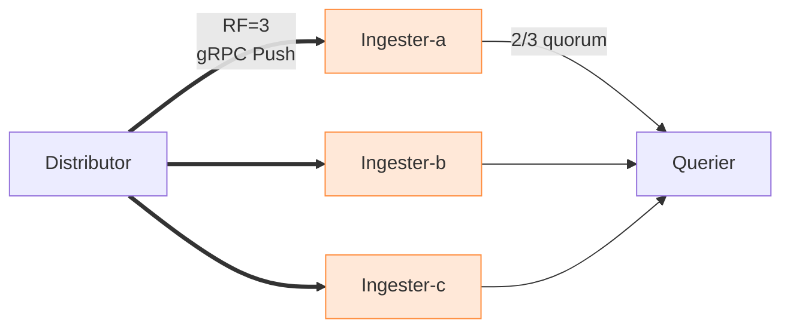
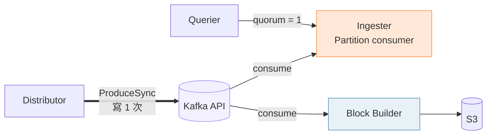

# 從 Thanos 到 Mimir 3.0

## AI 時代下 · 我們如何重構可觀測性的地基

  
Mike Hsu 

  Mimir 3.0
  AutoMQ
  Parquet

<!--
開場建議（自由發揮）：
- 自我介紹 + 今天 40 分鐘要帶大家走的路
- Hook 句：「最神奇的 AI 世界，底下跑的還是這些最不性感的基礎設施」
- 這是一份工程日誌，不是產品宣傳：會有踩坑、會有真實成本數字、會有沒解決的難題
- 這場演講會分享我們從 Thanos 遷移到 Mimir 的真實歷程
- 最後會帶大家看一下長期指標後端的未來方向（Parquet Gateway）
-->

---
layout: quote
---

# 我們 Metrics 後端的 主要使用者 已經不再是人類

觀測者從人換成 Agent， 從偶爾查到 24/7。

<!--
切入動機（hook 要講得慢一點）：
- 以前 metrics 是給 SRE 早上喝咖啡時看 dashboard 用的
- 現在組織裡越來越多人建立自己的 agent — SRE agent、DB agent、service agent
- 一個人消化資訊的能力有限；AI agent 一秒吞下一整面 dashboard，還會追著問下一層
- 查詢模式從「偶爾」變成「連續」、從「手動」變成「程式化」
- 我們原本的 metrics 基礎設施（Thanos）每天被這些 agent 嚴峻考驗
-->

---
layout: inner
title: AI Agent 時代下，基礎設施備受考驗。
---

  

    
Reserved for Live Demo

    
▶ SRE Agent Videos

  

  
⏱ 20–30 sec budget

<LabelText title="現在">幾個 agent 在跑。尚未飽和。</LabelText>
<LabelText title="即將到來">DB · Service · Cost · Security agents。</LabelText>
<LabelText title="這只是開始">負載是現在的幾倍。地基得現在打。</LabelText>

<!--
這頁是「影片位」，投影片負責 framing：
- 這幾部影片是我們 SRE team 正在跑的 agent
- 它們 24/7 在打我們的 metrics backend — 比任何 dashboard 都兇
- 未來會有更多 agent：DB agent、service agent、cost agent…
- 重點：這還只是 early adopter 階段。一旦全公司飽和，metrics backend 的負載是現在的幾倍
- 所以我們選型時，看的不是今天的工作負載，是兩年後的
-->

---
layout: inner
title: 我們目前的規模
---

  <Stat value="40" label="EKS Clusters" />
  <Stat value="120M" label="Peak Active Series" accent="red" />
  <Stat value="8M" label="Samples / sec" />
  <Stat value="365" label="retention period" />

  

    <mdi-memory class="why-card__icon" />
    

      
為什麼訂 Active Series

    

  

  
常駐記憶體 ≈ 8 KB × active series

  <ul class="why-list why-list--loose">
    <li><mdi-clock-outline class="why-list__icon" />TSDB head chunk</li>
    <li><mdi-magnify class="why-list__icon" />In-memory postings index</li>
    <li><mdi-tune class="why-list__icon" />Label set 本身</li>
  </ul>
  

    120M × 8 KB ≈ <strong>960 GB RAM</strong>
  

  
2023 年

  
選擇了 Thanos

  
當時最成熟的開源選項，唯一能無侵入掛 Sidecar。

  

    <mdi-clock-outline /> 服役時間超過三年。
  

<!--
這頁建立 credibility：
- 40 個 EKS cluster、尖峰 1.2 億 active series、每秒 8M samples、365 天保留
- 為什麼盯 active series？因為它直接決定 ingester 記憶體，而記憶體是長期指標後端最貴的資源
- 每條 series 約 8 KB（TSDB head chunk + postings index + label set）
- 1.2 億 × 8 KB = 960 GB — 光 ingester 就要這麼多 RAM
- 2023 選 Thanos 是當時正確的決定（sidecar mode 可以無侵入掛上現有 Prom）
- 但這個量級讓我們踩到所有結構性坑 — 正是今天要分享的故事
-->

---
layout: section-blue
chapter: "01"
parent: Thanos → Mimir 3.0
---

# 長期指標 後端架構

兩種架構 · 兩種設計哲學

<!--
進入第一大段：架構介紹
不要花太多時間科普，我們團隊內部都熟悉 Prometheus 生態
這段的目的是讓聽眾跟著我的思路建立對比架構
-->

---
layout: inner
title: Prometheus 孤掌難鳴
---

  

    <mdi-alert-circle class="why-card__icon" />
    

      
先天限制

    

  

  <ul class="why-list why-list--loose">
    <li style="font-size:1.15rem!important;"><mdi-clock-alert-outline class="why-list__icon" />本地留 <strong>14 天</strong>就滿。</li>
    <li style="font-size:1.15rem!important;"><mdi-database-off-outline class="why-list__icon" />單機儲存，單點壞掉就沒了。</li>
    <li style="font-size:1.15rem!important;"><mdi-magnify-close class="why-list__icon" />跨集群無法統一查詢。</li>
    <li style="font-size:1.15rem!important;"><mdi-memory class="why-list__icon" />記憶體用量跟著 active series 線性成長 ( 垂直擴展瓶頸 )</li>
  </ul>

  

    <mdi-lightbulb-on-outline class="why-card__icon" />
    

      
被要求做的事

    

  

  <ul class="why-list why-list--loose">
    <li style="font-size:1.15rem!important;"><mdi-history class="why-list__icon" />看上個月的 baseline。</li>
    <li style="font-size:1.15rem!important;"><mdi-chart-timeline-variant class="why-list__icon" />熱門節日 vs. 平日。</li>
    <li style="font-size:1.15rem!important;"><mdi-trophy-outline class="why-list__icon" />算 SLO 年度達成率。</li>
    <li style="font-size:1.15rem!important;"><mdi-robot-outline class="why-list__icon" />讓 AI agent 連續回溯歷史 ( 一個窗口可能發幾千個 PromQL )</li>
  </ul>

  要的是一個
  高吞吐
  ・
  低延遲
  ・
  便宜
  而且能擺脫單機天花板的長期儲存後端。

  

<!--
- 這張快速過，聽眾都懂
- 重點是最後一個 bullet：AI agent 的歷史回溯 — 這是現在新出現的需求
- 強調這跟以往的「偶爾查看 dashboard」是不同量級的
-->

---
layout: split
title: 兩種整合模式
kicker: Sidecar vs. Remote-Write.
ratio: "1:1"
---

::left::

<IntegrationCompare pane="sidecar" />

::right::

<IntegrationCompare pane="remote" />

<!--
補充：
- Sidecar 是 Thanos 的標誌性設計，跟 Cortex/Mimir 的 remote_write 哲學不同
- 兩者各有優缺點，先看 Sidecar 的妙處
-->

---
layout: inner
title: Sidecar 的巧妙之處
kicker: 它不重工，效率至上。
---

  

    
  

<Callout type="win" title="關鍵洞察">
<strong>S3 上的 block 和本地 disk 完全一樣</strong> 
Sidecar 不做任何運算
</Callout>

<Callout type="info" title="對比 Remote-write">
Backend 要解 protobuf、壓縮、重建 index
 
同一份運算做了兩次。</Callout>

<!--
補充（重要）：
- 這張是為了鋪陳「Sidecar 不是笨設計，它有它的巧妙」
- 這樣接下來的痛點討論才誠實
- 讓聽眾知道我們不是盲目換掉 Sidecar，是因為遇到了 Sidecar 架構的結構性問題
-->

---
layout: quote
quote_variant: pivot
---

  
但是，三年之後

  

    我們
    面臨的痛點
  

  
Thanos Sidecar 架構下的兩處侷限。

<!--
過場頁：給聽眾一個心理緩衝
- 前面講完 Sidecar 的好
- 現在要誠實展示為什麼我們要離開
- 分兩個痛點：短期查詢 + 長期查詢
-->

---
layout: split
eyebrow: '痛點①短期查詢'
title: "垂直擴展瓶頸被 Sidecar 放大"
ratio: "3:2"
---

::left::

繼續走，只剩兩條路：<strong class="text-red-400">買更大的機器，或換架構</strong>

::right::

  

    
Single Prometheus Pod

    
512

    
GiB RAM

    

    

      
<strong>Prometheus</strong> 400+ GiB

      
<strong>Sidecar</strong> 50+ GiB

    

    

      Sidecar 幫短期查詢扛 remote-read buffer  <strong>記憶體壓力被放大。</strong>
    

  

<!--
這是整場第一個 money shot。
補充（自由發揮）：
- 512 GiB 聽起來很誇張，但那是我們真實的 production 數字
- 我們的 Prometheus 已經在單一節點 vertical 到這個程度
- 繼續往下走只剩兩條路：買更大的機器 / 或換架構
- 這個數字是我們決定遷移的第一個導火線
-->

---
layout: inner
eyebrow: '痛點②長期查詢'
title: "Thanos 與 Mimir 查詢細節差異"
kicker: "不是 Thanos 不好，只是我們踩坑踩到心力憔悴。"
---

  

    
靜態 SHARDING

    
01

    
寫死在 manifest 改一次要全部 block 重分配

    
Mimir：Hash Ring 自動 rebalance。

    

      <mdi-source-branch /> 重新分配成本高
    

  

  

    
社群開發節奏慢

    
02

    
Mimir 2.7 已支援 Thanos 到 2026-01 才 merge

    
Mimir 2.7（2023-01）預設 batched streaming StoreGateway：5000 series / gRPC message。 Thanos 直到 2026-01 才 merge PR #8623 補齊  <strong>我們 2025-12 做決定時，它還沒出來。</strong> 

    

      <mdi-timeline-clock /> 多租戶保護成熟度有差
    

  

  

    
多租戶不友善

    
03

    
一個 heavy long-range 查詢佔滿所有 worker，其他租戶全部排隊

    
Mimir：有 per-tenant fair queuing，吵鬧鄰居影響不到其他人。

    

      <mdi-account-alert /> 單點 heavy query 會放大成全域問題
    

  

<!--
補充：
- 這段不要深講 11 維度的比較，聽眾會消化不下
- 重點讓聽眾感受：Mimir Store-Gateway 是為大規模多租戶設計的，Thanos 是從 Prometheus 長出來的
- 兩者的設計前提不同，不是誰對誰錯
-->

---
layout: inner
title: 三條決策維度：開始之前，再想清楚
---

  
短期瓶頸

  
01

  
Sidecar vs Remote-Write

  
把壓縮、建 index 丟給後端， 緩解 Prometheus 瓶頸

  

    <mdi-speedometer /> 緩解短期垂直瓶頸
  

  
長期瓶頸

  
02

  
Thanos vs Mimir

  
bucket-index、動態 sharding、 為多租戶規模而生

  

    <mdi-database-search /> 解決長期查詢瓶頸
  

  
採集端

  
03

  
Prom Server vs Prom Agent

  
所有查詢只依賴統一儲存後端

  

    <mdi-alert-octagon /> 最激進 · 風險最高
  

<!-- 

  <mdi-lightbulb-on class="path-conclusion__icon" />
  

    三個維度互相<strong style="color:#F26D4F">獨立</strong> · 下一頁把排列組合攤開，一個一個刪去
    保持好奇 · 保持懷疑 · 保持實驗
  

 -->

<!--
- 一次介紹三個決策維度 — 把思考空間先攤開
- ① 緩解短期瓶頸：可以先做
- ② 解決長期查詢：需要換後端
- ③ 砍 Prom Server：最激進，HPA / KEDA / Alert evaluation 都綁在 Prom 上
- 三個維度是「可以獨立組合」的，所以下一頁會畫排列組合
- 特別強調 ③ Prom Agent 的風險：HPA/KEDA 依賴 metrics 作決策，如果 metrics backend 不穩，business 會受直接影響
-->

---
layout: inner
kicker: 刪去法
title: 五個排列組合，活下來一個
---

  
①

  

    
Sidecar · Thanos · Prom Server

    
維持現況

  

  ？

  
②

  

    
Remote-Write · Thanos · Prom Server

    
短期解了，長期查詢沒解

  

  ？

  
③

  

    
Remote-Write · Thanos · Prom Agent

    
長期沒解，還疊加 alert 風險

  

  ？

= 1 }">
  
④

  

    
Remote-Write · Mimir · Prom Server

    
短期緩解 + 長期解 · Prom Server 留作最後防線

  

  = 1 ? 'good' : 'warn'">{{ $clicks >= 1 ? '選這條' : '？' }}

  
⑤

  

    
Remote-Write · Mimir · Prom Agent

    
HPA / KEDA / Alert 全依賴 Mimir，穩定後的終極優化

  

  ？

  <mdi-lightbulb-on class="path-conclusion__icon" />
  

    刪去法 → 剩下 <strong style="color:#F26D4F;">④</strong>：Mimir 換後端、Prom Server <strong>保留</strong> 做最後防線
  

<!--
- 排列空間的合法性約束要先點出來：
  - Mimir 沒有 Sidecar 模式（它只吃 remote-write）
  - Prom Agent 無本地 TSDB（沒 block 可給 Sidecar 上傳）
- 所以實際合法組合是 5 個（原本的 Sidecar+Mimir 根本不存在）
- ①②③ 都是 Thanos 系，結構性問題各自沒解完
- ⑤ 太激進：Prom Agent = alert / HPA / KEDA 全交給後端，後端抖動就業務抖動
- 保留 Prom Server 是保險決策 — 未來想切 Agent，這條路還能走
-->

---
layout: section-blue
chapter: "02"
parent: Thanos → Mimir 3.0
---

# Mimir 3.0 架構 的新地基

為什麼偏偏現在換

<!--
進入 Mimir 3.0 介紹段
先給大畫面 (官方圖)，再拆解
-->

---
layout: split
title: Mimir 3.0 剛好到位
ratio: "1:1"
---

::left::

::right::

  
<mdi-check-circle />Reliability

  
寫讀徹底解耦

  
Kafka 當中繼實現持久性 · 讀掛掉寫照常 · quorum 從 2/3 降到 1

  
<mdi-chart-line />Performance

  
MQE streaming

  
Peak CPU ↓80% · Peak Mem ↓3×

  
<mdi-content-cut />Cost

  
Querier / Ingester 使用量減半

  
不再靠 RF=3 · ~25% TCO ↓

<!-- 

  接下來拆兩個支柱講 — 先 <strong style="color:#F7A86B">Ingest Storage</strong>，再 <strong style="color:#5296B8">MQE</strong>

 -->

<!--
- Grafana 官方 Mimir 3.0 三大主題：Reliability / Performance / Cost
  - 右半 Data to ingest → distributor → Kafka → ingesters = 寫路徑（Ingest Storage 核心）
  - 左半 Queries → query-frontend → querier → ingesters + store-gateway = 讀路徑
  - Compactor 在 object storage 背後壓縮
- 下方三卡片講三大支柱：Reliability（解耦）/ Performance（MQE）/ Cost（Ingester 減半）
- 下兩頁深入 Ingest Storage
-->

---
layout: split
title: "Ingest Storage"
kicker: "寫 3 次 → 寫 1 次"
ratio: "1:1"
---

::left::

= 1 }">

Classic · v2

= 1 }">
  
為什麼要 2/3 quorum？

  
<strong>Dynamo-style 不變式：</strong> <code>R + W &gt; N</code> W=2 · R=2 · N=3 → <strong>4 &gt; 3 ✓</strong> ，讀集合要跟最新寫入交集才讀得到

::right::

= 1 }">

Ingest Storage · v3

= 1 }">
  
為什麼 quorum = 1 就夠？

  
<strong>Kafka partition = linearized log</strong> 每個 consumer 都 replay 同一份 log · 無分歧 · 不需 overlap

<!--
- 左右對比把最關鍵的變化講清楚：
  - 寫入從 3 副本變 1 次
  - Ingester 從「什麼都做」變成純 consumer
  - Block 建構拆出去 — 各元件獨立 scale
- 兩欄各自底部：2/3 的 Dynamo 不變式 vs Kafka 單一 log 為何只需 quorum=1（純 split，無第三列）
- 引自 Grafana 官方（Jonathan）：「我們依賴的不是 Kafka，是 Kafka API」— 可換 WarpStream / Redpanda / AutoMQ
- Kafka API 不是 Kafka — 這個很重要，為後面 AutoMQ 鋪路
-->

---
layout: split
title: 讀掛了 · 寫照常
kicker: quorum = 1
ratio: "5:3"
---

::left::

::right::

<Callout type="win" title="讀取可用性">
v2：過半 zone 健康才算活 
v3：<strong>每個 partition 有 1 個消費者就算活</strong>
</Callout>

<Callout type="info" title="可用性解耦">
熱查詢再兇，寫入只到 Kafka 就結束 
<strong>Write 永遠 HEALTHY</strong>
</Callout>

<!-- 

  
實戰意義

  
熱查詢再兇 · 寫入只到 Kafka 就結束 <strong>Write 永遠 HEALTHY</strong>

 -->

<!--
- 這張圖視覺效果很強：Write ✅ / Read ✗
- v2 的 quorum 是 2/3，只要 2 個 zone 各死 1 個 ingester 就掛
- v3 的 quorum 是 1 — 每個 partition 有 1 個 ingester 活著就活
- 想提高可用性？加 partition（便宜），不用加整個 zone（貴）
- 對 SRE 的意義：查詢爆炸不再變成寫入事件；alert 的源頭不會因此消失
-->

---
layout: inner
title: 可用性不一定要靠 Replication
align: start
---

<table class="repl-table">
  <thead>
    <tr>
      <th class="repl-table__dimension">維度</th>
      <th>
        Classic
        RF=3 + 3 ZONES
      </th>
      <th>
        Ingest
        3 ZONES
      </th>
      <th class="repl-table__focus" :class="{ 'is-active': $clicks >= 1 }">
        Ingest
        2 ZONES ✦
      </th>
    </tr>
  </thead>
  <tbody>
    <tr>
      <td class="repl-table__dimension">副本決定方式</td>
      <td>RF=3（寫 3 次）</td>
      <td>zone 數決定</td>
      <td class="repl-table__focus" :class="{ 'is-active': $clicks >= 1 }">zone 數決定</td>
    </tr>
    <tr>
      <td class="repl-table__dimension">實際副本數</td>
      <td class="repl-table__metric repl-table__metric--neg">3×</td>
      <td>3×</td>
      <td class="repl-table__focus repl-table__metric repl-table__metric--pos" :class="{ 'is-active': $clicks >= 1 }">2×</td>
    </tr>
    <tr>
      <td class="repl-table__dimension">Write 容錯</td>
      <td>1 zone (2/3 quorum)</td>
      <td>Kafka 負責</td>
      <td class="repl-table__focus" :class="{ 'is-active': $clicks >= 1 }">Kafka 負責</td>
    </tr>
    <tr>
      <td class="repl-table__dimension">Read quorum</td>
      <td class="repl-table__metric repl-table__metric--neg">2/3</td>
      <td class="repl-table__metric repl-table__metric--info">1/3</td>
      <td class="repl-table__focus repl-table__metric repl-table__metric--pos" :class="{ 'is-active': $clicks >= 1 }">1/2</td>
    </tr>
    <tr>
      <td class="repl-table__dimension">Read 容錯</td>
      <td>1 zone</td>
      <td class="repl-table__metric repl-table__metric--info">2 zones</td>
      <td class="repl-table__focus" :class="{ 'is-active': $clicks >= 1 }">1 zone</td>
    </tr>
    <tr>
      <td class="repl-table__dimension">Ingester 成本</td>
      <td class="repl-table__metric repl-table__metric--neg">3×</td>
      <td>3×</td>
      <td class="repl-table__focus repl-table__metric repl-table__metric--pos" :class="{ 'is-active': $clicks >= 1 }">2×</td>
    </tr>
    <tr>
      <td class="repl-table__dimension">額外成本</td>
      <td class="repl-table__muted">—</td>
      <td>Kafka</td>
      <td class="repl-table__focus" :class="{ 'is-active': $clicks >= 1 }">Kafka</td>
    </tr>
  </tbody>
</table>

  

    

      

        <mdi-trophy-outline style="font-size:1rem;color:#C97C3A;flex-shrink:0;" />
      

      
把可用性從「RF 堆出來」換成「Kafka 保證 + partition 調整」

    

  

<!--
- Classic 生產必須 RF=3 + 3 zones（因為 RF=2 是 0 容錯 — quorum 要 2/2）
- v3 改用 PartitionInstanceRing：不再用 RF，由 zone 數決定副本
- 2 zones + Ingest Storage 拿到比 classic 3 zones 還強的 read 容錯
- 真正省到 33% ingester 資源
- 這是整個 Mimir 3.0 最大的成本殺手
-->

---
layout: split
title: 無痛升級
kicker: Mimir Query Engine
ratio: "3:2"
---

::left::

::right::

  <Stat value="92%" label="less memory vs Prom engine" accent="orange" />
  <Stat value="38%" label="faster execution" accent="blue" />
  <Stat value="3×" label="Querier peak mem ↓" accent="orange" />
  <Stat value="80%" label="Querier peak CPU ↓" accent="blue" />

<!--
補充：
- MQE 在 Mimir 3.0 是 default
- 相比舊的 Prometheus engine，streaming execution + optimization framework
- 這張 benchmark 是官方 1h range query 1000 series 的 sum() 測試
- 實際 Grafana Cloud 跑下來 querier peak memory 降 3x、peak CPU 降 80%
- 這個是「我們遷移後立刻拿到的」好處，不需要做什麼
-->

---
layout: inner
title: 遷移後 · 寫讀兩端資源同時下降
align: start
---

  
Ingester · CPU

  

  
Ingester · Memory

  

  
Querier · CPU

  

  
Querier · Memory

  

<!--
- 這四張是我們自己集群的真實 dashboard 截圖，不是 benchmark
- 橘色兩張：Ingester CPU / Memory — 寫路徑的紅利
  - RF 從 3 降到 2 · Ingest Storage 把副本責任交給 Kafka
  - 明顯看到升級當天一個斷崖式下降
- 青色兩張：Querier CPU / Memory — 讀路徑的紅利
  - MQE streaming execution 讓查詢不再全量載入 series
  - Peak 被壓平
- CPU / Memory 都明顯下降一個 level
- 不是 benchmark，是 production — 數字不漂亮，但真實
-->

---
layout: section-blue
chapter: "03"
parent: Thanos → Mimir 3.0
---

# Kafka 選型

多了一個元件 · 我們是不是在自找麻煩？

<!--
進入 Kafka / AutoMQ 章節 — 整場演講的重頭戲
開場用這句話引出下一張
-->

---
layout: inner
align: start
clicks: 2
---

= 1 }">
  <h1 class="p17-title">多加一個 Kafka 是不是把事情搞更複雜？</h1>
  
= 1 }">
    
回答這個問題之前，先來看個公式，任何有 queue 的系統都適用

  

  
= 2 }">
    
L = λ · W

    
Little's Law · 李式定理

    

      

        
L

        
Queue 中的 平均任務數

      

      

        
λ

        
系統吞吐率 (samples/s)

      

      

        
W

        
每件事花的 處理時間

      

    

    

      L 堆積 = 流入（停不住）× 處理時間（下游拖慢） 
      這就是背壓的來源
    

  

<!--
補充：
- 我當初跟主管討論時也被問過這個問題
- 加一個元件 = 多一份複雜度，這是直覺
- 但實際上複雜度不會憑空消失，你只是選擇把它放在哪裡
- 李式定理告訴我們的是：系統吞吐的本質
-->

---
layout: inner
title: 整條鏈路，牽一髮，動全身
align: start
---

  

    
  

  
<mdi-alert-circle class="why-card__icon" />真實踩過的坑

  
Ingester 卡住 → Kafka 堆積 → Distributor produce timeout → Prom queue full → 全環境噴 alert

  
<mdi-lightbulb-on class="why-card__icon" />我們學到的

  
Kafka 不永遠低延遲。Rebalance、leader 切換、consumer lag，任一件都能把 5ms 變 5 秒。

<!--
重要（誠實調性）：
- 這段是我想表達的核心態度：不盲目推薦
- 分享真實踩坑：有一次 Kafka consumer 變慢，根因追到 Ingester
- 但當下看到的是「Prom 噴 queue full alert」
- 這種跨元件 debug 是 Kafka 架構的固有複雜度
- 我們接受了這個，因為換來的好處夠大（下面會講）
-->

---
layout: quote
quote_variant: pivot
---

  
但我們還是選了它

  

    因為我們賭的
    不是今天的 Kafka
    是明天的
  

  
如果只是要解耦，我們不會跳進這個坑 社群這兩年悄悄決定了 Kafka 的未來

<!--
- 承接上一頁的踩坑 — rebalance / leader 切換 / consumer lag / broker 掛 / PVC 崩
- 這些我們都真的遇過、都還在踩 — 如果只是要「解耦」，其實沒必要跳進這個坑
- 我們踩下去的原因：社群的下一個十年，已經悄悄改寫了 Kafka
- object storage 是 source of truth · broker stateless · PVC 不再是命脈
- 下一頁帶大家走過這兩年的 diskless 浪潮 — KIP-1150 Diskless Wars
-->

---
layout: split
title: 下一個十年 · Diskless Kafka
ratio: "4:5"
---

::left::

  
Aug 2023

  
WarpStream 發表 — Kafka-API on S3 首發商用化

  
May 2024

  
Confluent Freight 發表

  
Jul 2024

  
<strong>AutoMQ 1.0</strong> 發布 · S3 Direct 寫入

  
Sep 2024

  
Confluent 收購 WarpStream — $220M

  
Apr 2025

  
<strong>Aiven 提出 KIP-1150</strong> Diskless Topics

  
Nov 2025

  
Redpanda 發表 Cloud Topics

  

  
Mar 2026

  

    
Apache Kafka

    
KIP-1150 正式通過，社群正式擁抱 diskless

  

::right::

  

    
  

<!--
- 左側時間軸：這兩年 Kafka 生態正在經歷一場 diskless 浪潮
  - 從 WarpStream（2023）開局，到 KIP-1150 今年 3/2 正式通過
- 右側截圖：Aiven 的 Josep / Greg 的通告 + 底下 Apache 郵件投票結果
  - 真實感很強，這不是 PR 稿，是社群裡真人真投票
  - 9 binding votes + 5 non-binding votes
- 結論：AutoMQ 不是冒險選擇，是走在共識已成方向上的最早一批
-->

---
layout: split
title: AutoMQ · 最小改動的 Diskless Kafka 分支
ratio: "5:4"
---

::left::

::right::

  

    

      <mdi-alert-circle class="why-card__icon" />
      

        
物理 Kafka 三個痛

      

    

    

      
Broker 有狀態，每次重啟都搬資料。

      
Rebalance storm，加縮 broker 網段大遷移。

      
跨 AZ 流量吃掉 60–70% 成本。

    

  

  

    

      <mdi-lightbulb-on-outline class="why-card__icon" />
      

        
AutoMQ + S3 Storage 分流

      

    

    

      
Broker stateless，spot-friendly，秒級 rebalance。

      
S3 自帶多副本，broker 間 zero replication。

      
100% Kafka API，Producer/Consumer 0 改動。

    

  

<!--
- AutoMQ 的基本構想：把 Kafka 的 local disk 換成 S3 + 小 WAL
- 傳統 Kafka：PageCache + Local Disk → Consumer（Zero Copy）
- AutoMQ：Producer → WAL + Message Cache → S3；Consumer 從 S3/Cache 拉（沒有 Zero Copy 但也夠快）
- 關鍵：100% Kafka API 相容 — 我們的 Prometheus distributor / Mimir ingester 完全不用改
-->

---
layout: split
title: 跨 AZ 流量 · 傳統 Kafka 的黑洞
ratio: "3:2"
footnote: "AutAutoMQ 官方：大叢集跨 AZ 流量占 <strong style='color:#F26D4F'>60–70% </strong>的 Kafka 總成本，不是花在業務，是花在跨區網路傳輸。"
---

::left::

::right::

  
① Producer → Broker

  
寫入可能 hit 其他 AZ 的 leader

  
② Broker ↔ Broker Replication

  
Replication 幾乎必定跨 AZ

  
③ Consumer ← Broker

  
Consumer 不一定跟 leader 同 AZ

<!--
- 傳統 Kafka 的三種跨 AZ 流量：
  1. Producer → Broker：client 通常不知道 leader 在哪個 AZ
  2. Broker → Broker replication：這條幾乎免不了，除非 RF=1（不能用在 prod）
  3. Broker → Consumer：consumer 也不一定跟 leader 同 AZ
- 在 AWS 上這三條 traffic 通通算 inter-AZ data transfer（每 GB 都收錢）
- 大叢集可以佔到 60-70% 總成本 — 這比 EC2 本身還貴
- 下一頁看 AutoMQ 怎麼把這筆錢歸零
-->

---
layout: split
title: AutoMQ 的解法 · Zero-Zone Router
ratio: "3:2"
footnote: "AWS 同 region S3<strong style='color:#F26D4F'>免費</strong>，把 60–70% 的 Kafka 帳單直接歸零"

---

::left::

  

::right::

流量路由設計

<ul class="icon-list">
  <li><mdi-tune />Producer 寫入<strong>本地 AZ</strong> 的 broker</li>
  <li><mdi-swap-horizontal />Rack-aware Router 透過 <strong>S3</strong> 路由給 leader partition</li>
  <li><mdi-database-sync />其他 AZ 從 S3 同步拿 <strong>readonly 副本</strong></li>
  <li><mdi-download />Consumer 從<strong>本地 AZ</strong> 的 readonly replica 讀取</li>
</ul>

<!--
Zero-Zone Router 分步講解：
1. Producer 在 AZ2 寫入 → 只寫 AZ2 的 broker（本地，不跨 AZ）
2. AZ2 的 Rack-aware Router 把資料透過 S3「路由」給 AZ1（leader partition 所在地）
3. AZ1 從 S3 讀取完成寫入 · 其他 AZ 也從 S3 拿 readonly 副本
4. Consumer 在 AZ2 讀取 → 只從 AZ2 的 readonly replica 讀（本地，不跨 AZ）
關鍵：
- Producer ↔ Broker / Consumer ↔ Broker 全部 in-AZ
- 唯一跨 AZ 流量：broker ↔ S3，而 AWS 同 region S3 免費
- 把傳統 Kafka 最大的帳單項目（60-70% 成本）直接砍到零
-->

---
layout: split
title: 容量與彈性 · 從「預留」到「按用量」
ratio: "5:4"
---

::left::

  

::right::

  
<mdi-alert-circle />Apache Kafka

  
Fixed · Wasted &gt; 50%

  
Local disk 預配足 peak · scaling 以「小時」計

  
<mdi-chart-line />AutoMQ

  
Pay-as-you-go

  
S3 近乎無限 · partition 搬移以「秒」計 · Broker 可跑 spot

<!--
- Apache Kafka 必須 over-provision — 因為 broker 搬資料需要幾小時
- AutoMQ 因為 partition 不綁 local disk，搬移以「秒」計
- 結果：可以真正跟著業務流量彈性 scale，不用多付 50% 浪費
- 也可以用 spot instance（因為 broker stateless，死了也沒事）
-->

---
layout: inner
eyebrow: 優點都說完了
title: 那缺點呢？
---

  
Traditional Kafka · EBS

  

    
5–50ms

    
Produce ACK P99

  

  
AutoMQ · S3Stream

  

    
500ms –1s

    
Produce ACK P99（10× 的差距）極端情況 ~30 秒才能在 Mimir 讀取

  

  

    

      <mdi-lightbulb-on style="font-size:1.3rem;color:#C97C3A;flex-shrink:0;" />
      
划算的取捨

    

    
Alert · HPA · KEDA 繼續走 Prom Server（毫秒） / Mimir 是「秒級」長期後端，業務不受影響

  

<!--
- 很多人第一眼看到 500ms–2s 會嚇到
- 但關鍵是整條鏈路：
  - scrape interval 本身就 15-30s
  - remote_write 本身有 batch 延遲
  - Kafka produce + consume + ingester index
  - 長尾抖動
  - 加起來 scrape 後 ~30 秒才能查到也是正常的
- 然後呼應前面「保留 Prom Server」的伏筆：
  - 短期查詢 / alert / HPA / KEDA 都走 Prom（毫秒）
  - 長期查詢走 Mimir（秒級可接受）
  - 10× 延遲的代價換來跨 AZ 流量歸零 + 運維解放 + 10× 成本結構差異
- 典型的 engineering tradeoff：知道自己在意什麼，才能做聰明的取捨
-->

---
layout: section-blue
chapter: "04"
parent: Thanos → Mimir 3.0
---

# 數字說話

三週生產並行 · AWS 真實帳單

<!--
進入成果展示段
這段要放輕鬆一點，讓聽眾有「哇」的反應
-->

---
layout: inner
title: 實測
kicker: Mimir 勝
align: start
---

  

  

    
測試設計

    <ul class="why-list li-xl">
      <li><mdi-check-circle class="why-list__icon" />同一 production 環境 · 相同 tenant</li>
      <li><mdi-check-circle class="why-list__icon" />8 種 query × 6 個時間範圍 = <strong>48 組</strong></li>
      <li><mdi-check-circle class="why-list__icon" />Cache busting</li>
      <li><mdi-check-circle class="why-list__icon" />1h → 30d 全覆蓋</li>
    </ul>
  

    

      
結果

      
45 / 48 tests

    

  

  

    <Stat value="3.4×" label="平均查詢加速" accent="sky" />
    <Stat value="16.7×" label="Cross-metric Join 30d" accent="red" />
    <Stat value="8.4×" label="High-cardinality 1h" accent="sky" />
    <Stat value="6.3×" label="長期 30d 查詢" accent="red" />
  

<!--
- 48 組測試是我們自己跑的，不是 benchmark，用 production 資料
- 最有趣的發現：長期查詢 Mimir 優勢反而更大
- 因為 Mimir 的 bucket-index + MQE streaming 讓 30d 查詢的記憶體佔用平緩
- Thanos 做同樣查詢時 store gateway 會 OOM
- 完全顛覆「Thanos 擅長長期查詢」的迷思
-->

---
layout: inner
align: center
---

  3 週 AWS 帳單實測

<h1 class="!text-8xl !mb-6" style="color:#F26D4F;letter-spacing:-0.04em;">省 49%.</h1>

  3.4× 更快 
  ·
  多數場景勝出
  ·
  ~6× 性價比

  不同環境量級，絕對數字僅供參考。Annual Saving 落在幾十萬美金量級。

<!--
- 3 週生產環境並行，AWS Cost Explorer 真實帳單
- Thanos 這邊 EC2 instance 吃掉大頭（Store Gateway 重度 compute）
- Mimir + AutoMQ：EC2 instance 省掉一大截
- Data transfer 差不多（AutoMQ 把跨 AZ 流量歸零，但多了 Kafka 本身的 produce/consume 路徑）
- 每家公司的 baseline 不同，重點不是絕對數字
- 重點是「ROI 好到讓我把遷移提案推上去時非常好講」
-->

---
layout: section-blue
chapter: "05"
parent: Thanos → Mimir 3.0
---

# 下一站 可觀測性 2.0?

PromCon 2025 · 關注社群的前沿趨勢

<!--
進入最後一段
這段是「帶禮物回家」的段落
讓聽眾覺得「我學到新東西，還想回去研究」
-->

---
layout: inner
eyebrow: 可觀測性 2.0
title: 單一事實來源 · Wide Events
kicker: Charity Majors · 2024 命名 · 原型是 Meta Scuba (VLDB 2013)
---

  
01

  
主力提倡者

  <ul class="why-list" style="gap:1.2rem;">
    <li style="margin-left:0.25rem;"><mdi-chart-line class="why-list__icon" /><strong>Honeycomb</strong> — wide events 先驅，把 Scuba 商用化</li>
    <li style="margin-left:0.25rem;"><mdi-chart-line class="why-list__icon" /><strong>ClickHouse</strong> — 自家 observability 撐到 100 PB+</li>
    <li style="margin-left:0.25rem;"><mdi-chart-line class="why-list__icon" /><strong>Iceberg / Delta Lake</strong> — open lake format 成匯流點</li>
  </ul>

  
02

  
為什麼 Prom 還沒被取代

  <ul class="why-list" style="gap:1.2rem;margin-top:1.2rem;">
    <li style="margin-left:0.25rem;"><mdi-alert-circle class="why-list__icon" />PromQL + Alerts + HPA / KEDA 生態深度綁定</li>
    <li style="margin-left:0.25rem;"><mdi-alert-circle class="why-list__icon" />OTel semantic conventions 尚沒成熟</li>
    <li style="margin-left:0.25rem;"><mdi-alert-circle class="why-list__icon" />新興技術，大多數團隊仍在觀望</li>
  </ul>

<!--
- 可觀測性 2.0 不是我憑印象寫的，是個有明確主張、有來源、有社群動能的技術路線
- 術語來自 Charity Majors（Honeycomb CTO）· 原型是 Meta Scuba（VLDB 2013）
- 核心主張：wide events 是唯一事實來源，metrics / logs / traces 都從它派生
- 勢頭側：
  - Honeycomb 是先驅
  - ClickHouse 是商用化主力（ClickStack 2025、自家跑到 100PB 級）
  - GreptimeDB / Pinot / DuckDB / InfluxDB IOx 一整批 OLAP 底座新玩家
  - Iceberg / Delta Lake 讓 wide events 可以和資料湖匯流
- 阻力側：
  - Prom 生態不只是 query — 是 dashboards / alerts / HPA / KEDA 整套
  - 換成本太高，大部分團隊先解成本問題
  - OTel 語意還沒穩
- 結論：Prom 生態不是被外部吃掉，是**自己吸收** columnar / wide event 的好處 → Parquet Gateway
- 參考：charity.wtf · honeycomb.io/blog · ClickHouse engineering blog
-->

---
layout: image-callout-split
eyebrow: PromCon 2025
title: Parquet Gateway · 三大專案核心成員同台
kicker: Cortex · Thanos · Mimir maintainer 首次同台
align: start
ratioLeft: 5
ratioRight: 4
---

::left::

<!-- 
Grafana · Cloudflare · AWS 同台
 -->

::right::

  
prometheus-community / parquet-common

  
共同 Artifact

  <ul class="icon-list li-lg pg-artifact__list">
    <li style="margin-left:0.25rem;"><mdi-check-decagram />Passes <strong>100%</strong> PromQL acceptance tests</li>
    <li style="margin-left:0.25rem;"><mdi-database-search />Built-in Queryable implementation</li>
    <li style="margin-left:0.25rem;"><mdi-swap-horizontal-variant />TSDB block → Parquet schema converter</li>
  </ul>

::after::

  <Stat value="83.6%" label="Faster queries" accent="red" />
  <Stat value="89.3%" label="Less bucket GET-range" accent="ink" />
  <Stat value="72.4%" label="Less memory" accent="red" />
  <Stat value="41.6%" label="Fewer allocations" accent="ink" />

<!--
- 三家同台本身就是 message：Cortex / Thanos / Mimir 過去是競爭關係，現在合流推 Parquet Gateway
- 源頭：Shopify Filip Petkovski 的 Thanos Parquet PoC → Cloudflare parquet-tsdb-poc → 匯流到 prometheus-community/parquet-common 共享 library
- 100% PromQL acceptance tests — 不是新語法，是既有 PromQL 原汁原味
- Parquet Common 實測四格數字已併入本頁；下一張接 banner 敘事
-->

---
layout: inner
kicker: 為什麼 TSDB 不該住在 S3
title: I/O 經濟學 · 資料結構特性才是關鍵
align: start
---

  
<mdi-flash />I/O Performance

  
SSD random read <code>~100μs</code> S3 random read <code>~10–50ms</code> <strong>差異 100–500×</strong>

  
<mdi-alert-octagon />TSDB on S3

  
<strong>100+</strong> random GETs  每個 GET 都是 HTTP round-trip

  
<mdi-check-circle />Parquet on S3

  
<strong>3–4</strong> sequential reads  Row-group index + columnar skip

  
<mdi-alert-circle class="why-card__icon" />TSDB 的結構性不對

  <ul class="why-list">
    <li><mdi-harddisk class="why-list__icon" />TSDB 原本是為 <strong>本地 SSD random read</strong> 設計</li>
    <li><mdi-cloud-download-outline class="why-list__icon" />搬到 S3 之後，讀取模式變成<strong>大量小 random GET</strong></li>
  </ul>

  
<mdi-alert-circle class="why-card__icon" />Store Gateway 的連鎖代價

  <ul class="why-list">
    <li><mdi-harddisk class="why-list__icon" />昂貴的本地 disk</li>
    <li><mdi-clock-outline class="why-list__icon" />啟動時間長</li>
    <li><mdi-server-network class="why-list__icon" />被迫 stateful</li>
  </ul>

<!--
First-principles + 三家共痛：
- S3 的 I/O 經濟學：TTFB 高（~ms 級）、throughput 高；天生適合順讀大塊、怕小塊隨讀
- TSDB 為本地 SSD 設計，random read 便宜；搬到 S3 就變每次 HTTP round-trip
- 一個典型 PromQL 查詢在 TSDB 可能要 100+ random GETs；同樣查詢在 Parquet 只要 3-4 次 sequential
- TSDB 資料雖然「有序」，但序是對 SSD random 友善，不是對 S3 sequential 友善
- 結果：Store Gateway 被迫扛一堆 state（disk cache / index header）來攤平 lookup → 昂貴 · 慢 · 脆弱 · 過度配置
- 這三個問題在 Cortex / Thanos / Mimir 身上**一模一樣**，所以三家才會坐下來聯合推 Parquet Gateway
- Parquet 格式自帶 row-group index + columnar skip → querier 可以 stateless 直讀 S3
- Michael Hoffmann 在 PromCon 把這段講得很清楚：「gateways have to be stateful to amortize some lookups」— 這不是 bug，是 TSDB 格式搬錯家的結果
-->

---
layout: inner
align: center
class: end-dark
---

= 1 }">
  
= 1 }">
    Thanos → Mimir 3.0 → AutoMQ → Parquet Gateway
  

= 1 }">

  <h1 class="!text-7xl !font-black" style="letter-spacing:-0.04em;color:#F5F0EB;" v-if="$clicks >= 1">Thank you</h1>

  
01

  
選型

  
理解瓶頸在哪裡 比追新技術更重要

  
02

  
架構

  
Stateless 是 運維自由的基礎

  
03

  
心態

  
技術選型永遠是 time-sensitive

= 2 }">
  <mdi-compass-outline class="hl-banner__icon" />
  

    保持好奇 · 保持懷疑 · 保持實驗
  

  <mdi-email-outline />
  Mike Hsu
  ·
  <code>mike.hsu@opennet.tw</code>

<!--
結語：
- 三個 takeaway 是整場演講的精華
- "time-sensitive selection" 這個 takeaway 很重要
- 我們 2024-2025 年選 Mimir 是對的，但 2027 年的最優解可能是 Parquet-based 的什麼
- 保持學習、保持懷疑、保持實驗
- QA 時間
-->
